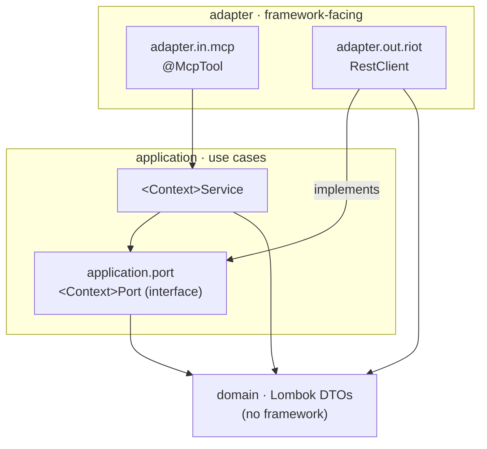

# Architecture

This project is organized as a set of **bounded-context hexagons** (ports & adapters) rather than
a traditional layered `controller/service/repository` stack. For a server whose whole job is to
adapt one external API into MCP tools, the hexagon makes the important boundary — *our code vs. the
Riot HTTP API* — explicit and testable, and keeps each Riot context independent.

## Why hexagonal here

- **The interesting boundary is I/O.** Every feature is "call a Riot endpoint, map the JSON, hand it
  to a tool." Putting an outbound **port** at that boundary lets us test all of our logic without a
  network, and swap the real Riot adapter for a fake in a line of code.
- **Contexts stay independent.** `account`, `summoner`, `match`, and `spectator` never reach into
  each other. The only cross-context dependency allowed is `analytics`, which composes the others.
- **The rules are enforced, not aspirational.** ArchUnit tests fail the build if the dependency
  direction or the naming/placement conventions are violated (see [Enforcement](#enforcement)).

We deliberately keep it lightweight for a showcase of this size: there is **no inbound-port
interface** (MCP tools call application services directly), and **no separate wire-vs-domain DTOs**
— the read-only Riot JSON shapes are relocated into each context's `domain/` package as-is. These
are recorded as decisions in [`docs/knowledge/decisions/`](docs/knowledge/decisions/).

## Bounded contexts

```
com.wkaiser.riotapimcpserver
├── account/      Riot account lookup (cross-game): Riot ID ↔ PUUID
├── summoner/     League of Legends summoner profiles (platform-routed)
├── match/        Match IDs and match detail (region-routed); no MCP tool
├── spectator/    Live-game / featured-game data (platform-routed)
├── analytics/    Composing context — aggregates account + summoner + match
└── shared/       Cross-cutting: config, the HTTP client, enums, exceptions
```

Every Riot context has the same internal shape:

```
<context>/
├── domain/                         relocated Lombok DTOs (no framework imports)
├── application/
│   ├── <Context>Service            application service — pure orchestration logic
│   └── port/<Context>Port          outbound port (interface) — the boundary
└── adapter/
    ├── in/mcp/<Context>Tool        inbound adapter — @McpTool entry points
    └── out/riot/Riot<Context>Adapter   outbound adapter — implements the port with RestClient
```

`analytics` is the exception: it has `domain/` (`PlayerMatchAnalytics`), an `application/`
(`AnalyticsService` depending on the account/summoner/match **application services**), and an
`adapter/in/mcp/AnalyticsTool` — but **no** `adapter/out/riot` and no port, because it makes no
direct Riot calls. `match` is the mirror exception: it has a port and adapter but **no** inbound
tool, because it is consumed only by `analytics`.

## The dependency rule

Dependencies point **inward only**: `adapter → application → domain`. Concretely:

- `domain` depends on nothing outward and on no framework (Lombok annotations only).
- `application` depends on `domain` and its own `port` — never on any `adapter`.
- `adapter.out.riot` implements a `port` and may use `domain`; it is the **only** place that knows
  `RestClient`.
- `adapter.in.mcp` depends on an application service; it is the **only** place that knows `@McpTool`.
- Cross-context references are forbidden — **except** `analytics` depending on other contexts'
  application services.



## The shared Riot HTTP client

All HTTP plumbing lives in `shared/http/RiotApiClient` (a `@Component`). It exposes two
pre-configured `RestClient` factories:

```java
RestClient regional(RiotApiRegionUri region);    // account, match  (region-routed)
RestClient platform(RiotApiPlatformUri platform); // summoner, spectator (platform-routed)
```

Each returned client already carries the `X-RIOT-TOKEN` header (from typed `RiotApiProperties`), the
assembled base URL, and a status handler that maps any non-2xx response to
`RiotApiException(message, statusCode)`. Base URL is `https://<host>` in production or
`RiotApiProperties.getBaseUrlOverride()` when set — which is how tests point requests at a local
mock server.

This replaces what used to be copy-pasted into four services (a private `createPlatformClient()`,
the header constant, `@Value("${riot.apiKey}")`, and a near-identical `try/catch`). Outbound
adapters now inject `RiotApiClient` and only make calls. One context-specific rule stays in the
adapter, not the shared handler: `RiotSpectatorAdapter` catches `RiotApiException` and returns
`null` on `404` ("summoner not in game").

## Regional vs. platform routing

Riot splits endpoints across two host families. `shared/enums` models both:

- `RiotApiRegionUri` — `AMERICAS`, `EUROPE`, `ASIA`, `SEA` — for account and match endpoints.
- `RiotApiPlatformUri` — `NA1`, `EUW1`, `KR`, … — for summoner and spectator endpoints.

Picking the wrong family yields a 404 from Riot; the enum split makes the correct choice a
compile-time decision at each adapter.

## Enforcement

ArchUnit (`architecture/` test suite, run under `./gradlew build`) encodes the rules above so a
violation fails the build:

- the layered dependency rule (`domain` ⇸ `application` ⇸ `adapter`, inward only);
- `RestClient` is referenced only within `..adapter.out.riot..`;
- `@McpTool` appears only within `..adapter.in.mcp..`;
- ports are interfaces residing in `..application.port..`;
- no context depends on another context's internals, except `analytics`;
- naming: `*Service` in `application`, `*Tool` in `adapter.in.mcp`, `*Adapter` in
  `adapter.out.riot`, `*Port` interfaces in `application.port`.

**JaCoCo** measures coverage on every `test` run and CI publishes the summary to the pull request;
the threshold is intentionally conservative — the signal is "coverage is visible," not an arbitrary
gate. **Spotless** (`spotlessCheck`) fails the build on formatting drift; `spotlessApply` fixes it.

## Testing strategy

Two complementary layers, both offline (no Riot API key, provable in CI):

- **Outbound adapter tests (WireMock).** Each `Riot*Adapter` runs against a local WireMock server via
  `RiotApiProperties.getBaseUrlOverride()`. Tests assert the request URL, the `X-RIOT-TOKEN` header,
  JSON→DTO deserialization, and error mapping — including the spectator `404 → null` behaviour and
  non-404 errors surfacing as `RiotApiException` with the status preserved. Canned JSON fixtures live
  in `src/test/resources/fixtures/`.
- **Application-service tests (in-memory fakes).** Services are tested against hand-written fakes
  implementing the port interfaces — fast, no HTTP. `AnalyticsService` is tested with fake
  account/summoner/match collaborators, covering the edge cases (zero games; zero-death KDA).

This split mirrors the hexagon: adapters are verified against the wire, services against their
ports. See [CONTRIBUTING.md](CONTRIBUTING.md) for the commands and how to add a new adapter test.
