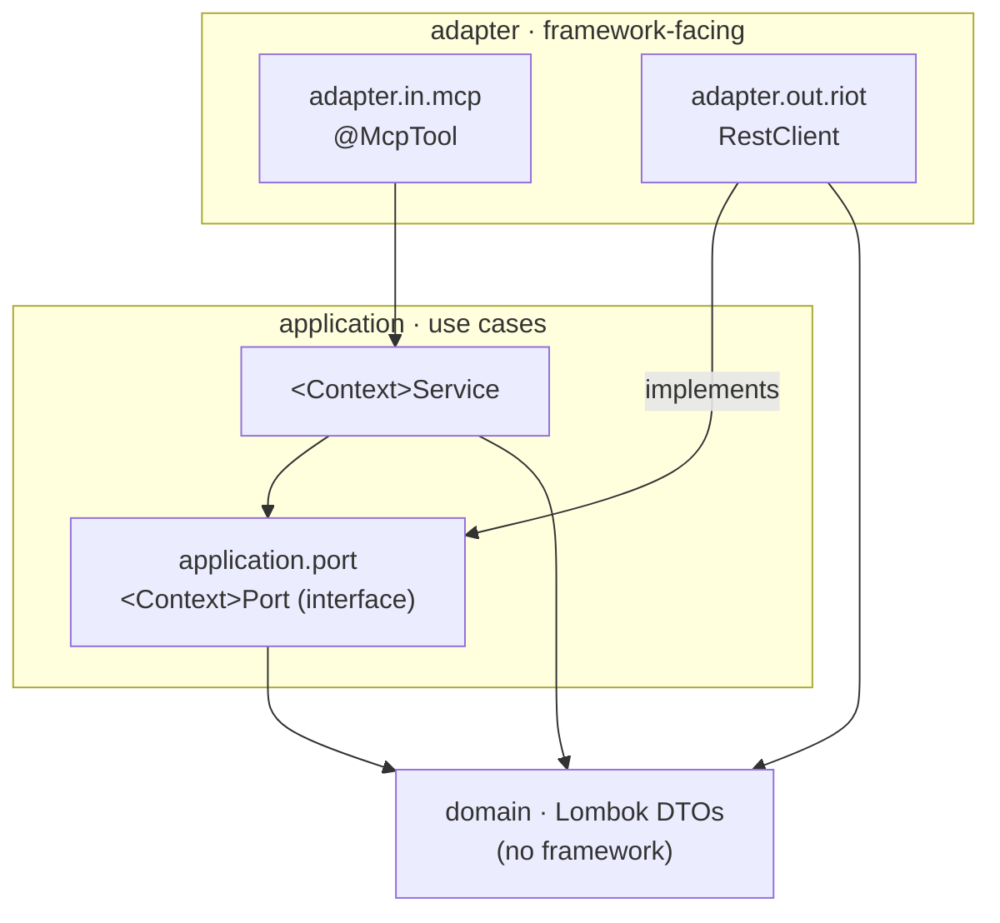

# Architecture

This project is a **Gradle monorepo**: two libraries and one Spring Boot MCP server per Riot game
(currently just League of Legends), each organized internally as a set of **bounded-context
hexagons** (ports & adapters) rather than a traditional layered `controller/service/repository`
stack. For a server whose whole job is to adapt one external API into MCP tools, the hexagon makes
the important boundary — *our code vs. the Riot HTTP API* — explicit and testable, and keeps each
Riot context independent. See [ADR-0006](docs/knowledge/decisions/ADR-0006-monorepo-split.md) for
why the monorepo split happened; the hexagon rationale itself predates it and still stands
([ADR-0001](docs/knowledge/decisions/ADR-0001-hexagonal.md)).

## Module layout

```
riot-api-core/         library — com.muddl.riot.core
  config/                 RiotApiProperties, RiotApiAutoConfiguration
  enums/                  RiotApiRegionUri, RiotApiPlatformUri
  exception/              RiotApiException
  http/                   RiotApiClient (all HTTP/auth/error handling)
  (testFixtures)          HexagonRules, Fixtures — shared across every module's tests

riot-account-core/     library — com.muddl.riot.account
  domain/                 RiotAccount
  application/            RiotAccountService
  application/port/       RiotAccountPort
  adapter/out/riot/       RiotAccountRiotAdapter
  config/                 RiotAccountAutoConfiguration
  (no @McpTool — see below)

lol-mcp-server/        Spring Boot app — com.muddl.riot.lol
  account/adapter/in/mcp/     RiotAccountTool (thin — delegates into riot-account-core)
  summoner/, match/, spectator/, analytics/, league/   full hexagons
```

Both libraries are consumed via `@AutoConfiguration` (`AutoConfiguration.imports`), never
component-scanned — a server picks them up as ordinary dependencies, with no package-scanning
coupling to know about. **Dependency rule at the module level:** `lol-mcp-server` →
`riot-account-core` → `riot-api-core`, never back, and it is enforced by Gradle at compile time —
`riot-api-core` simply has no dependency on a game module, so it structurally cannot reach into one.

`riot-account-core` deliberately ships **no** `@McpTool` (enforced by `AccountArchitectureTest`'s
`no_mcp_tools_in_this_library` rule). account-v1 is cross-game: a tool declared in the library would
appear, identically named, in every installed game server and collide inside the MCP client. Each
server instead owns a thin inbound adapter of its own — `lol-mcp-server`'s is
`com.muddl.riot.lol.account.adapter.in.mcp.RiotAccountTool`, which has no domain or application
layer of its own; those live in `riot-account-core`. That asymmetry — a context with only an
`adapter/in/mcp/` package — is intentional, not an oversight; see ADR-0006's "Asymmetry to know
about."

## Why hexagonal here

- **The interesting boundary is I/O.** Every feature is "call a Riot endpoint, map the JSON, hand it
  to a tool." Putting an outbound **port** at that boundary lets us test all of our logic without a
  network, and swap the real Riot adapter for a fake in a line of code.
- **Contexts stay independent.** `account`, `summoner`, `match`, and `spectator` never reach into
  each other. The only cross-context dependency allowed is `analytics`, which composes the others.
- **The rules are enforced, not aspirational.** ArchUnit tests fail the build if the dependency
  direction or the naming/placement conventions are violated (see [Enforcement](#enforcement)).

We deliberately keep it lightweight for a showcase of this size: there is **no inbound-port
interface** (MCP tools call application services directly), and **no separate wire-vs-domain DTOs**
— the read-only Riot JSON shapes are relocated into each context's `domain/` package as-is. These
are recorded as decisions in [`docs/knowledge/decisions/`](docs/knowledge/decisions/).

## Bounded contexts

Every Riot context in a server has the same internal shape:

```
<context>/
├── domain/                         relocated Lombok DTOs (no framework imports)
├── application/
│   ├── <Context>Service            application service — pure orchestration logic
│   └── port/<Context>Port          outbound port (interface) — the boundary
└── adapter/
    ├── in/mcp/<Context>Tool        inbound adapter — @McpTool entry points
    └── out/riot/Riot<Context>Adapter   outbound adapter — implements the port with RestClient
```

Two shapes recur as deliberate exceptions: a **composing** context (an application service that
depends on other contexts' services, with an inbound tool but no port or Riot adapter of its own),
and a **tool-less** context (a port and adapter consumed only by a composing context, with no inbound
tool). A server's own context list — including which contexts take which shape — lives in that
server's ARCHITECTURE, e.g. [`lol-mcp-server`](lol-mcp-server/ARCHITECTURE.md#bounded-contexts).

## The dependency rule

Dependencies point **inward only**: `adapter → application → domain`. Concretely:

- `domain` depends on nothing outward and on no framework (Lombok annotations only).
- `application` depends on `domain` and its own `port` — never on any `adapter`.
- `adapter.out.riot` implements a `port` and may use `domain`; it is the **only** place that knows
  `RestClient`.
- `adapter.in.mcp` depends on an application service; it is the **only** place that knows `@McpTool`.
- Cross-context references are forbidden — **except** `analytics` depending on other contexts'
  application services.



## The shared Riot HTTP client

All HTTP plumbing lives in `riot-api-core`'s `com.muddl.riot.core.http.RiotApiClient` (a
`@Component`, auto-configured by `RiotApiAutoConfiguration`). It exposes two pre-configured
`RestClient` factories:

```java
RestClient regional(RiotApiRegionUri region);    // account, match  (region-routed)
RestClient platform(RiotApiPlatformUri platform); // summoner, spectator (platform-routed)
```

Each returned client already carries the `X-RIOT-TOKEN` header (from typed `RiotApiProperties`), the
assembled base URL, and a status handler that maps any non-2xx response to
`RiotApiException(message, statusCode)`. Base URL is `https://<host>` in production or
`RiotApiProperties.getBaseUrlOverride()` when set — which is how tests point requests at a local
mock server.

This replaces what used to be copy-pasted into four services (a private `createPlatformClient()`,
the header constant, `@Value("${riot.apiKey}")`, and a near-identical `try/catch`). Outbound
adapters now inject `RiotApiClient` and only make calls. One context-specific rule stays in the
adapter, not the shared handler: `RiotSpectatorAdapter` catches `RiotApiException` and returns
`null` on `404` ("summoner not in game").

## Regional vs. platform routing

Riot splits endpoints across two host families. `riot-api-core`'s `com.muddl.riot.core.enums`
models both:

- `RiotApiRegionUri` — `AMERICAS`, `EUROPE`, `ASIA`, `SEA` — for account and match endpoints.
- `RiotApiPlatformUri` — `NA1`, `EUW1`, `KR`, … — for summoner and spectator endpoints.

Picking the wrong family yields a 404 from Riot; the enum split makes the correct choice a
compile-time decision at each adapter.

## Enforcement

Two different mechanisms enforce the two different rules in this repo, and the split is
deliberate:

- **The module dependency rule (`lol-mcp-server` → `riot-account-core` → `riot-api-core`) is
  enforced by Gradle at compile time**, not by an ArchUnit test. `riot-api-core` has no dependency
  on `riot-account-core` or any game module, so it structurally cannot reach into one — there is
  nothing for a test to check.
- **The intra-module hexagon rules are enforced by ArchUnit**, run under `./gradlew build`. They
  are defined once, in `HexagonRules` (`riot-api-core`'s test fixtures,
  `com.muddl.riot.core.testsupport`), and declared as `@ArchTest` fields by each module's own
  architecture test — `HexagonalArchitectureTest` in `lol-mcp-server` (10 rules) and
  `AccountArchitectureTest` in `riot-account-core` (7 rules) — so a new game server inherits the
  architecture instead of copy-pasting it:
  - the layered dependency rule (`domain` ⇸ `application` ⇸ `adapter`, inward only);
  - `RestClient` is referenced only within `..adapter.out.riot..` (and the core HTTP client itself);
  - `@McpTool` appears only within `..adapter.in.mcp..`;
  - `riot-account-core` ships no `@McpTool` at all (`AccountArchitectureTest` only);
  - ports are interfaces residing in `..application.port..`, both by package and by name;
  - naming: `*Service` in `application`, `*Tool` in `adapter.in.mcp`, `*Adapter` in
    `adapter.out.riot`, `*Port` interfaces in `application.port`.
  - **Context independence within a server** is a single `slices()` rule —
    `contexts_do_not_depend_on_each_other` — rather than the hand-maintained N-by-N matrix (one rule
    per context, each enumerating every other) this replaced. It stays correct as contexts are added.
    Its deliberate composition exceptions are a per-server fact — see the server's ARCHITECTURE (e.g.
    [`lol-mcp-server`](lol-mcp-server/ARCHITECTURE.md#context-independence-as-applied-here)).
  - **Account-domain usage is a separate, additional rule** —
    `only_analytics_and_the_account_tool_use_the_account_domain` — because extracting the account
    context to `com.muddl.riot.account` moved it outside the slice matcher above, which would
    otherwise silently have retired the old prohibitions. Stated deny-by-default: only a server's
    `analytics` and `account` contexts may depend on the account **domain** (`..riot.account..`);
    identity resolution (`..riot.account.identity..`) is deliberately excluded and open to every
    context (see [ADR-0008](docs/knowledge/decisions/ADR-0008-shared-player-identity-resolution.md)).

**JaCoCo** measures coverage on every `test` run and CI publishes the summary to the pull request;
the threshold is intentionally conservative — the signal is "coverage is visible," not an arbitrary
gate. **Spotless** (`spotlessCheck`) fails the build on formatting drift; `spotlessApply` fixes it.
All three run in every module via the shared `buildSrc` convention plugin.

## Testing strategy

Two complementary layers, both offline (no Riot API key, provable in CI):

- **Outbound adapter tests (WireMock).** Each `Riot*Adapter` runs against a local WireMock server via
  `RiotApiProperties.getBaseUrlOverride()`. Tests assert the request URL, the `X-RIOT-TOKEN` header,
  JSON→DTO deserialization, and error mapping — including the spectator `404 → null` behaviour and
  non-404 errors surfacing as `RiotApiException` with the status preserved. Canned JSON fixtures live
  in `src/test/resources/fixtures/`.
- **Application-service tests (in-memory fakes).** Services are tested against hand-written fakes
  implementing the port interfaces — fast, no HTTP. `AnalyticsService` is tested with fake
  account/summoner/match collaborators, covering the edge cases (zero games; zero-death KDA).

This split mirrors the hexagon: adapters are verified against the wire, services against their
ports. See [CONTRIBUTING.md](CONTRIBUTING.md) for the commands and how to add a new adapter test.

## Transports: stdio and sse

Every server ships two Spring profiles selecting how the MCP protocol is carried:

- **`stdio`** (the default) — the MCP client spawns the server process directly and talks
  JSON-RPC over its stdin/stdout. `application-stdio.yml` disables the banner and console logging
  so nothing but protocol frames reaches stdout; see
  [`docs/knowledge/gotchas.md`](docs/knowledge/gotchas.md) before touching stdio logging
  configuration.
- **`sse`** — the server listens over HTTP, message endpoint `/mcp/messages` on port `8080`. Safe
  to log normally, since the protocol doesn't share a stream with anything. This is the profile the
  container image runs (`ENV SPRING_PROFILES_ACTIVE=sse` in the `Dockerfile`).
