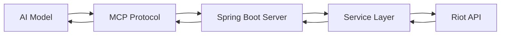

# Riot API MCP Server

[](https://github.com/Muddl/riot-api-mcp-server/actions)
[](https://openjdk.java.net/projects/jdk/21/)
[](https://spring.io/projects/spring-boot)
[](LICENSE)

> **AI-First Gaming API Platform** - A Spring Boot middleware server that bridges AI models with the Riot Games API ecosystem through the Model Context Protocol (MCP).

## 🚀 Quick Start

### Prerequisites
- **Java 21** (OpenJDK or Oracle JDK)
- **Riot API Key** - [Get yours here](https://developer.riotgames.com/)
- **Anthropic API Key** (for AI integration)

### Installation & Setup

1. **Clone the repository**
   ```bash
   git clone https://github.com/muddl/riot-api-mcp-server.git
   cd riot-api-mcp-server
   ```

2. **Configure API Keys**
   ```yaml
   # application.yml
   riot:
     apiKey: "YOUR_RIOT_API_KEY"
     region: "AMERICAS"  # or EUROPE, ASIA, SEA

   anthropic:
     apiKey: "YOUR_ANTHROPIC_API_KEY"
   ```

3. **Build and Run**
   ```bash
   ./gradlew build
   ./gradlew bootRun
   ```

4. **Verify Installation**
   ```bash
   curl http://localhost:8080/actuator/health
   ```

## 🎯 What is this?

The **Riot API MCP Server** transforms League of Legends data into AI-consumable insights through standardized tools. It serves as intelligent middleware that allows AI models to:

- 🔍 **Query player profiles** and match histories
- 📊 **Generate analytics** and performance insights
- 🎮 **Monitor live games** in real-time
- 🧠 **Process complex gaming data** through natural language

### Real-World Use Cases

```
🤖 AI Model: "Analyze the last 10 ranked games for Faker on Korean server"
📡 MCP Server: Fetches data from Riot API → Processes analytics → Returns insights
🎯 Result: "Faker has 8-2 W/L, 3.2 KDA, prefers Azir mid (60% pick rate)"
```

## 🛠️ Core Features

### 🔧 MCP Tools Portfolio
| Tool | Purpose | AI Model Usage |
|------|---------|----------------|
| **RiotAccountTool** | Cross-game account lookup | `"Find account for Player#TAG"` |
| **SummonerTool** | LoL summoner profiles | `"Get summoner rank and level"` |
| **AnalyticsTool** | Advanced match analytics | `"Analyze champion performance"` |
| **LiveGameTool** | Real-time spectator data | `"Check if player is in game"` |

### 🏗️ Architecture Highlights

- **🌍 Regional Architecture**: Automatic routing across Riot's global infrastructure
- **⚡ Advanced Analytics**: Multi-API data aggregation and statistical analysis
- **🔄 Real-time Monitoring**: Live game spectating with the Spectator API v4
- **🛡️ Production Ready**: Enterprise security, monitoring, and deployment planning

## 📚 Documentation

| Document | Purpose | Audience |
|----------|---------|----------|
| **[CLAUDE.md](CLAUDE.md)** | Development guidance & patterns | Developers |
| **[FEATURES.md](FEATURES.md)** | Current features & roadmap | Product & Tech |
| **[PLAN.md](PLAN.md)** | Production deployment strategy | DevOps & Leadership |
| **[CHANGELOG.md](CHANGELOG.md)** | Version history & changes | All stakeholders |

## 🚀 Development

### Build Commands
```bash
# Build project and run tests
./gradlew build

# Run tests only
./gradlew test

# Start development server
./gradlew bootRun

# Clean build artifacts
./gradlew clean
```

### Testing Strategy
- **Unit Tests**: Service and tool method validation
- **Integration Tests**: Disabled by default (require live API keys)
- **Compilation Tests**: DTO validation and Lombok verification

### Development Guidelines
- **Lombok Pattern**: All DTOs require `@Data`, `@Builder`, `@NoArgsConstructor`, `@AllArgsConstructor`
- **Error Handling**: Use `RiotApiException` and `GlobalExceptionHandler`
- **Testing**: Mock Riot API responses for reliable unit testing

## 🏛️ Architecture

### Service Layer Structure
```
├── riot/
│   ├── account/        # Cross-game account management
│   ├── lol/
│   │   ├── summoner/   # LoL summoner data
│   │   ├── match/      # Match history & details
│   │   ├── analytics/  # Advanced analytics engine
│   │   └── spectator/  # Live game monitoring
└── shared/             # Configuration & utilities
```

### MCP Integration Flow


## 🔮 Live Game Monitoring

### Real-Time Capabilities
- **Current Game Data**: Players, champions, bans, game mode
- **Platform Support**: All LoL regions (NA1, EUW1, KR, etc.)
- **Error Handling**: Graceful "not in game" responses
- **AI Optimization**: Structured data for model consumption

### Example Usage
```java
@Tool(name = "check_if_summoner_in_game")
public boolean checkIfSummonerInGame(String summonerName, String platform) {
    // Returns true/false for live game status
}
```

## 🎯 Analytics Engine

### Comprehensive Statistics
- **Performance Metrics**: KDA, win rate, champion mastery
- **Match Analysis**: Recent game trends and patterns
- **Champion Insights**: Pick rates, success rates, role preferences
- **Edge Case Handling**: Zero games, perfect KDA scenarios

### Multi-API Orchestration
1. **Account Lookup** → Cross-game identifier resolution
2. **Platform Routing** → Region-specific data retrieval
3. **Data Aggregation** → Multi-endpoint result combination
4. **Statistical Processing** → Analytics and insights generation

## 🌐 Production Deployment

### AWS Infrastructure Ready
- **Container Orchestration**: ECS Fargate with auto-scaling
- **Load Balancing**: Application Load Balancer with SSL
- **Caching Layer**: Redis ElastiCache with intelligent TTL
- **Security**: WAF, IAM roles, encrypted API key management
- **Monitoring**: Prometheus, Grafana, comprehensive alerting

### Deployment Timeline
- **Phase 1-2** (Weeks 1-4): Infrastructure & core services
- **Phase 3-4** (Weeks 5-8): Security, monitoring, optimization
- **Phase 5-6** (Weeks 9-12): Production hardening & launch

**Estimated Monthly Cost**: $2,000-5,000 (scalable based on usage)

## 🤖 Multi-Agent Development

### Proven Coordination Patterns
This project demonstrates successful **multi-agent development** using Claude Code subagents:

#### Live Game Monitor Implementation Team
- **java-pro**: DTOs, service layer, Spring Boot integration
- **mcp-developer**: MCP tool implementation and optimization
- **test-automator**: Comprehensive test suite creation
- **agent-organizer**: Team coordination and workflow optimization

#### Production Deployment Planning Team
- **cloud-architect**: AWS infrastructure design
- **security-auditor**: Security frameworks and compliance
- **performance-engineer**: Caching and optimization strategies
- **deployment-engineer**: CI/CD pipelines and automation

### Team Assembly Patterns
```
Feature Request → agent-organizer → specialized team → coordinated execution
```

## 🔧 API Coverage

### Current Riot API Integration
| API Endpoint | Status | Capabilities |
|--------------|--------|--------------|
| **Account-v1** | ✅ Complete | Cross-game account lookup |
| **Summoner-v4** | ✅ Complete | LoL player profiles |
| **Match-v5** | ✅ Complete | Match history & details |
| **Spectator-v4** | ✅ Complete | Live game monitoring |
| **Champion Mastery-v4** | 🔄 Planned | Champion expertise data |
| **League-v4** | 🔄 Planned | Ranked ladder information |

### Regional Support
- **AMERICAS**: NA1, BR1, LA1, LA2, OC1
- **EUROPE**: EUW1, EUNE1, TR1, RU1
- **ASIA**: KR, JP1
- **SEA**: PH2, SG2, TH2, TW2, VN2

## 🤝 Contributing

### Development Workflow
1. **Fork** the repository
2. **Create** a feature branch (`git checkout -b feature/amazing-feature`)
3. **Commit** changes (`git commit -m 'Add amazing feature'`)
4. **Push** to branch (`git push origin feature/amazing-feature`)
5. **Open** a Pull Request

### Code Standards
- Follow existing **Lombok patterns** for DTOs
- Include **comprehensive tests** for new features
- Update **documentation** for API changes
- Use **multi-agent coordination** for complex features

## 📊 Project Status

### Current Version: 1.0.0
- ✅ **Core MCP Tools**: Account, Summoner, Analytics, Live Game
- ✅ **Production Planning**: Complete AWS deployment roadmap
- ✅ **Multi-Agent Success**: Proven coordination patterns
- ✅ **Enterprise Ready**: Security, monitoring, scalability

### Next Release (1.1.0) - Q2 2025
- 🔄 **Champion Mastery API**: Player expertise analytics
- 🔄 **Ranked Ladder Tools**: League positioning data
- 🔄 **Enhanced Analytics**: AI-powered insights engine
- 🔄 **Performance Optimization**: Sub-100ms response times

## 📄 License

This project is licensed under the MIT License - see the [LICENSE](LICENSE) file for details.

## 🙏 Acknowledgments

- **Riot Games** for providing comprehensive API access
- **Spring AI Team** for MCP protocol implementation
- **Claude Code Community** for multi-agent development patterns
- **Contributors** who helped build this AI-first gaming platform

---

**Made with ❤️ for the intersection of AI and Gaming**

> Transform gaming data into AI insights • [Documentation](CLAUDE.md) • [Features](FEATURES.md) • [Deployment](PLAN.md)