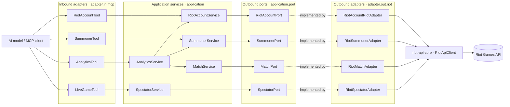

# Riot API MCP Server

[](https://github.com/Muddl/riot-api-mcp-server/actions/workflows/ci.yml)
[](ARCHITECTURE.md#testing-strategy)
[](https://openjdk.org/projects/jdk/21/)
[](https://spring.io/projects/spring-boot)
[](LICENSE)

A [Model Context Protocol](https://modelcontextprotocol.io) (MCP) server that exposes the
[Riot Games API](https://developer.riotgames.com/) to AI models as a small set of typed tools.
It is a Gradle monorepo on Spring Boot 4.1 / Spring AI 2.0 (Java 21) built as a **portfolio
piece**: the point is the engineering — a clean bounded-context hexagonal architecture, a single
shared HTTP client, HTTP-mocked tests that run in CI with no API key, and architecture rules
enforced at build time (some by ArchUnit, some by Gradle's module graph itself). An MCP client
(e.g. Claude Desktop) connects over `stdio` or `sse` and can look up Riot accounts and League of
Legends summoners, inspect live games, and pull aggregated match analytics.

Two libraries plus one Spring Boot server per Riot game — currently just `lol-mcp-server` for
League of Legends. See [ARCHITECTURE.md](ARCHITECTURE.md) for the module layout and
[ADR-0006](docs/knowledge/decisions/ADR-0006-monorepo-split.md) for why.

## Architecture at a glance

Each Riot context is a self-contained hexagon: an inbound MCP adapter calls an application service,
which depends on an outbound **port**; a Riot adapter implements that port. All HTTP, auth, and
error handling live in one place — `riot-api-core`'s `RiotApiClient`. `analytics` is a composing
context that calls the `account`, `summoner`, and `match` application services and has no Riot
adapter of its own; `account` itself lives in the separate `riot-account-core` library, consumed
by every game server.


```mermaid
flowchart LR
    AI["AI model / MCP client"]

    subgraph in["Inbound adapters · adapter.in.mcp"]
        AT["RiotAccountTool"]
        ST["SummonerTool"]
        LT["LiveGameTool"]
        NT["AnalyticsTool"]
    end

    subgraph app["Application services · application"]
        AS["RiotAccountService"]
        SS["SummonerService"]
        MS["MatchService"]
        PS["SpectatorService"]
        NS["AnalyticsService"]
    end

    subgraph port["Outbound ports · application.port"]
        AP["RiotAccountPort"]
        SP["SummonerPort"]
        MP["MatchPort"]
        SPP["SpectatorPort"]
    end

    subgraph out["Outbound adapters · adapter.out.riot"]
        AA["RiotAccountRiotAdapter"]
        SA["RiotSummonerAdapter"]
        MA["RiotMatchAdapter"]
        SPA["RiotSpectatorAdapter"]
    end

    RC["riot-api-core · RiotApiClient"]
    RIOT[("Riot Games API")]

    AI --> AT & ST & LT & NT
    AT --> AS
    ST --> SS
    LT --> PS
    NT --> NS
    NS --> AS & SS & MS
    AS --> AP
    SS --> SP
    MS --> MP
    PS --> SPP
    AP -. implemented by .-> AA
    SP -. implemented by .-> SA
    MP -. implemented by .-> MA
    SPP -. implemented by .-> SPA
    AA & SA & MA & SPA --> RC
    RC --> RIOT
```

See **[ARCHITECTURE.md](ARCHITECTURE.md)** for the full rationale, the dependency rule, and how it
is enforced.

## Quick start

Prerequisites: **Java 21** and a **Riot API key** (get a development key at
<https://developer.riotgames.com/>). Nothing else — no Anthropic key or any other credential is
needed to build, test, or run the server.

```bash
# 1. Provide your Riot API key (read from the environment by application.yml)
export RIOT_API_KEY="RGAPI-your-key-here"

# 2. Run the LoL server — stdio (default) is what local MCP clients expect
./gradlew :lol-mcp-server:bootRun

# ...or over SSE, for a client that connects over HTTP
./gradlew :lol-mcp-server:bootRun --args='--spring.profiles.active=sse'
```

Over `sse`, the server starts on `http://localhost:8080`; the MCP message endpoint is
`/mcp/messages`. Point your MCP client at it, or check liveness with
`curl http://localhost:8080/actuator/health`. Over `stdio` (the default), the client spawns the
process itself and talks JSON-RPC over its stdin/stdout — there is no port to check.

## MCP tools

`lol-mcp-server` exposes five inbound adapters to MCP clients (seven tool names in total):

| Tool (`adapter.in.mcp`) | MCP tool names | Purpose |
|-------------------------|----------------|---------|
| **RiotAccountTool** | `lol_account_by_player` | Riot account by player (Riot ID `GameName#TAG` or raw PUUID) |
| **SummonerTool** | `lol_summoner_by_player` | Summoner profile by player |
| **LiveGameTool** | `lol_spectator_current_game_by_player`, `lol_spectator_featured_games` | Live-game (Spectator v5) data; returns `null` when not in a game |
| **AnalyticsTool** | `lol_analytics_player_matches` | Aggregated recent-match analytics, composing the account, summoner, and match services |
| **LeagueTool** | `lol_league_entries_by_player`, `lol_league_apex_by_tier` | Ranked-league entries by player, and apex league (CHALLENGER/GRANDMASTER/MASTER) by tier + queue |

## Testing

Tests run **offline with no Riot API key** — CI proves it. Outbound adapters are exercised against a
local [WireMock](https://wiremock.org/) server (asserting request URLs, the `X-RIOT-TOKEN` header,
JSON→DTO parsing, and error mapping including the spectator `404 → null` rule); application services
are tested against in-memory port fakes. Architecture, coverage, and formatting are checked in the
same run.

```bash
./gradlew build          # compile + all tests + ArchUnit + JaCoCo + Spotless check
./gradlew test           # tests only
./gradlew spotlessApply  # auto-format sources
```

## Docker

A multi-stage `Dockerfile` builds one server module and runs it on a slim JRE 21, selected via
`--build-arg SERVER_MODULE=` (default `lol-mcp-server`; one image per game server, not one per
repo). The container reads `RIOT_API_KEY` from the environment and always runs the `sse` profile
(`ENV SPRING_PROFILES_ACTIVE=sse` — a container has no controlling terminal for `stdio` to spawn
into).

```bash
docker build -t lol-mcp-server .
docker run --rm -p 8080:8080 \
  -e RIOT_API_KEY="RGAPI-your-key-here" \
  lol-mcp-server
```

Tagging a release (`v*`) publishes an image to GHCR at
`ghcr.io/muddl/lol-mcp-server` via the `release.yml` workflow.

> **Note:** the image moved from `ghcr.io/muddl/riot-api-mcp-server` (pre-monorepo) to
> `ghcr.io/muddl/lol-mcp-server`. The old tags were not deleted, so pulling the old path still
> works — it just silently serves the last pre-monorepo image forever, not a redirect or an error.
> Update any pinned reference to the new path.

## Documentation

| Document | Purpose |
|----------|---------|
| **[ARCHITECTURE.md](ARCHITECTURE.md)** | Hexagonal design, bounded contexts, dependency rule, testing strategy |
| **[CONTRIBUTING.md](CONTRIBUTING.md)** | Build/test/format commands, conventions, how to add a context or tool |
| **[CLAUDE.md](CLAUDE.md)** | Guidance for AI coding agents working in this repo |
| **[CHANGELOG.md](CHANGELOG.md)** | Version history (Keep a Changelog) |
| **[docs/knowledge/](docs/knowledge/)** | Committed knowledge base — ADRs, patterns, gotchas, glossary |

## License

Released under the MIT License — see [LICENSE](LICENSE).
