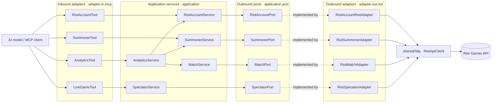
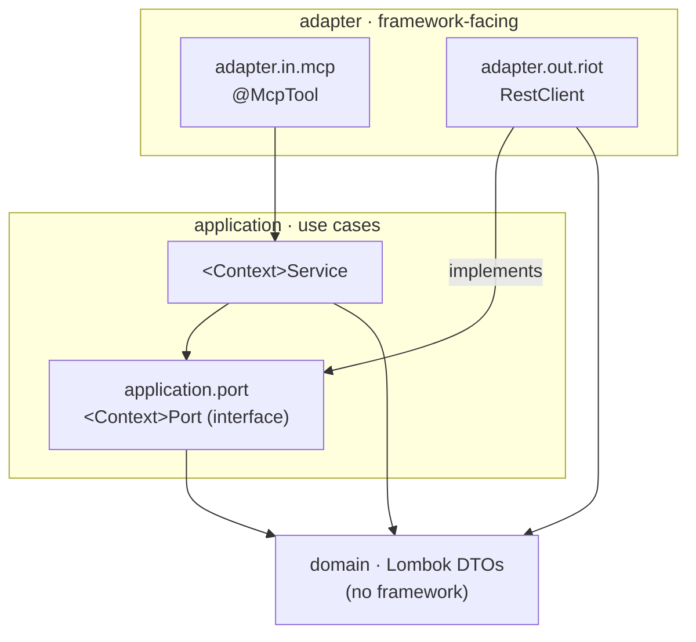

# Phase 5: Documentation — Implementation Plan

> **For agentic workers:** REQUIRED SUB-SKILL: Use superpowers:subagent-driven-development (recommended) or superpowers:executing-plans to implement this plan task-by-task. Steps use checkbox (`- [ ]`) syntax for tracking.

**Goal:** Replace the aspirational/fictional documentation with an honest, portfolio-grade docs suite that accurately describes the post-Phase-1..4 hexagonal codebase — deleting `PLAN.md`/`FEATURES.md`, rewriting `README.md`/`CLAUDE.md`, adding `ARCHITECTURE.md`/`CONTRIBUTING.md`, and pruning `CHANGELOG.md` to reality.

**Architecture:** This phase changes no application code. It edits Markdown at the repo root only. The docs describe the final state produced by Phases 1–4: bounded-context hexagons (`account`, `summoner`, `match`, `spectator`, `analytics`, `shared`) under `com.wkaiser.riotapimcpserver`, a single shared `RiotApiClient`, WireMock adapter tests, ArchUnit/JaCoCo/Spotless gates, and a `ci.yml`/`release.yml`/`Dockerfile`/GHCR pipeline. `README.md` and `CONTRIBUTING.md` forward-reference `docs/knowledge/` (created in Phase 6); those links resolve once Phase 6 lands and are permitted here.

**Tech Stack:** Markdown, Mermaid diagrams (GitHub-rendered), shields.io badges. No Java, Gradle, or runtime changes in this phase — the only build interaction is the final "`./gradlew build` still passes" sanity check.

## Global Constraints

- Docs-only phase: do **not** edit any file under `src/`, `build.gradle`, `application.yml`, or `.github/`. Every deliverable is a root-level `.md` file.
- Repo owner/URL is `Muddl` (`https://github.com/Muddl/riot-api-mcp-server`). Use that exact owner in every badge and link — never `your-username`.
- All type/package/class/tool names must match the post-Phase-1 structure exactly: package root `com.wkaiser.riotapimcpserver`; top-level contexts `account`, `summoner`, `match`, `spectator`, `analytics`, `shared`; services `*Service` in `<context>.application`; ports `*Port` in `<context>.application.port`; outbound adapters `*Adapter` in `<context>.adapter.out.riot`; tools `*Tool` in `<context>.adapter.in.mcp`.
- The four real MCP tool classes and their `@McpTool` names (verified in the current source, unchanged by Phase 1): `RiotAccountTool` (`get_riot_account_by_riot_id`, `get_riot_account_by_puuid`); `SummonerTool` (`get_lol_summoner_by_name`, `get_lol_summoner_by_puuid`, `get_lol_summoner_by_id`); `LiveGameTool` (`get_current_game_by_summoner_name`, `get_current_game_by_summoner_id`, `get_featured_games`, `check_if_summoner_in_game`); `AnalyticsTool` (`get_lol_player_match_analytics`). `match` has no tool.
- No fiction: no "83 subagents", no AWS "$2,000–5,000/month", no Prometheus/Grafana/ECS Fargate, no "multi-agent success stories", no dated "Recent Updates" logs, no unearned "enterprise/production-ready" claims, no invented benchmark numbers ("sub-100ms", "8-2 W/L Faker example").
- No dead links: every relative link must point to a file that exists after this phase **or** is created by Phases 4–6 (`Dockerfile`, `ci.yml`, `docs/knowledge/**`). `LICENSE` already exists.
- Versions referenced in docs are fixed: Java 21, Spring Boot 4.1.0, Spring AI 2.0.0. Do not alter them.
- Commands shown in docs use `./gradlew ...` (Git Bash on Windows). The final task ends with `./gradlew build` passing.

---

### Task 1: Delete the fictional documents

`PLAN.md` (fictional AWS production plan) and `FEATURES.md` (aspirational roadmap) are net-negative for a portfolio. Remove them and scrub inbound links (the README rewrite in Task 2 already drops them; this task only verifies no other tracked file still points at them after the whole phase, but here we just delete and confirm the files are gone).

**Files:**
- Delete: `PLAN.md`
- Delete: `FEATURES.md`

**Interfaces:** none. This task only removes files.

- [ ] **Step 1: Confirm the two files are currently tracked**

Run:

```bash
git ls-files PLAN.md FEATURES.md
```

Expected: two lines — `FEATURES.md` and `PLAN.md`.

- [ ] **Step 2: Remove both files from git and the working tree**

```bash
git rm PLAN.md FEATURES.md
```

Expected: `rm 'FEATURES.md'` and `rm 'PLAN.md'`.

- [ ] **Step 3: Verify the files are gone**

```bash
test ! -e PLAN.md && test ! -e FEATURES.md && echo "deleted"
```

Expected: `deleted`.

- [ ] **Step 4: Commit**

```bash
git add -A
git commit -m "docs: delete fictional PLAN.md and FEATURES.md"
```

---

### Task 2: Rewrite `README.md` as an honest front door

Replace the entire marketing-heavy README with an accurate one that reflects the real hexagon, the four real tools, WireMock testing, and Docker usage. The build and coverage badges point at the Phase 4 `ci.yml` workflow and the testing strategy respectively (no external coverage service is configured, so the coverage badge is a static shield linking to `ARCHITECTURE.md`).

**Files:**
- Modify (full replace): `README.md`

**Interfaces:**
- References (must resolve after Phases 4–6): `ARCHITECTURE.md` (Task 3), `CONTRIBUTING.md` (Task 4), `CHANGELOG.md` (Task 6), `LICENSE` (exists), `Dockerfile` (Phase 4), `.github/workflows/ci.yml` (Phase 4).

- [ ] **Step 1: Replace the entire contents of `README.md`**

Replace `README.md` with exactly the following (note the outer fence below is four backticks so the inner ```` ```mermaid ```` / ```` ```bash ```` fences are literal file content):

````markdown
# Riot API MCP Server

[](https://github.com/Muddl/riot-api-mcp-server/actions/workflows/ci.yml)
[](ARCHITECTURE.md#testing-strategy)
[](https://openjdk.org/projects/jdk/21/)
[](https://spring.io/projects/spring-boot)
[](LICENSE)

A [Model Context Protocol](https://modelcontextprotocol.io) (MCP) server that exposes the
[Riot Games API](https://developer.riotgames.com/) to AI models as a small set of typed tools.
It is a Spring Boot 4.1 / Spring AI 2.0 application (Java 21) built as a **portfolio piece**:
the point is the engineering — a clean bounded-context hexagonal architecture, a single shared
HTTP client, HTTP-mocked tests that run in CI with no API key, and architecture rules enforced at
build time. An MCP client (e.g. Claude Desktop) connects over SSE and can look up Riot accounts and
League of Legends summoners, inspect live games, and pull aggregated match analytics.

## Architecture at a glance

Each Riot context is a self-contained hexagon: an inbound MCP adapter calls an application service,
which depends on an outbound **port**; a Riot adapter implements that port. All HTTP, auth, and
error handling live in one place — `shared/http/RiotApiClient`. `analytics` is a composing context
that calls the `account`, `summoner`, and `match` application services and has no Riot adapter of
its own.



See **[ARCHITECTURE.md](ARCHITECTURE.md)** for the full rationale, the dependency rule, and how it
is enforced.

## Quick start

Prerequisites: **Java 21** and a **Riot API key** (get a development key at
<https://developer.riotgames.com/>).

```bash
# 1. Provide your Riot API key (read from the environment by application.yml)
export RIOT_API_KEY="RGAPI-your-key-here"

# 2. Run the server
./gradlew bootRun
```

The server starts on `http://localhost:8080`; the MCP SSE message endpoint is `/mcp/messages`.
Point your MCP client at it, or check liveness with `curl http://localhost:8080/actuator/health`.

> **Note:** the Spring AI Anthropic starter is on the classpath, so `bootRun` also expects
> `ANTHROPIC_API_KEY` to be set. It is **not** needed to build or to run the test suite — only to
> start the application. `export ANTHROPIC_API_KEY="sk-ant-..."` before `bootRun` if you hit a
> startup placeholder error.

## MCP tools

Four inbound adapters expose the Riot API to MCP clients:

| Tool (`adapter.in.mcp`) | MCP tool names | Purpose |
|-------------------------|----------------|---------|
| **RiotAccountTool** | `get_riot_account_by_riot_id`, `get_riot_account_by_puuid` | Cross-game Riot account lookup (Riot ID ↔ PUUID) |
| **SummonerTool** | `get_lol_summoner_by_name`, `get_lol_summoner_by_puuid`, `get_lol_summoner_by_id` | League of Legends summoner profiles |
| **LiveGameTool** | `get_current_game_by_summoner_name`, `get_current_game_by_summoner_id`, `get_featured_games`, `check_if_summoner_in_game` | Live-game (Spectator v4) data; returns `null`/`false` when not in a game |
| **AnalyticsTool** | `get_lol_player_match_analytics` | Aggregated recent-match analytics, composing the account, summoner, and match services |

## Testing

Tests run **offline with no Riot API key** — CI proves it. Outbound adapters are exercised against a
local [WireMock](https://wiremock.org/) server (asserting request URLs, the `X-RIOT-TOKEN` header,
JSON→DTO parsing, and error mapping including the spectator `404 → null` rule); application services
are tested against in-memory port fakes. Architecture, coverage, and formatting are checked in the
same run.

```bash
./gradlew build          # compile + all tests + ArchUnit + JaCoCo + Spotless check
./gradlew test           # tests only
./gradlew spotlessApply  # auto-format sources
```

## Docker

A multi-stage `Dockerfile` builds the app and runs it on a slim JRE 21. The container reads
`RIOT_API_KEY` from the environment.

```bash
docker build -t riot-api-mcp-server .
docker run --rm -p 8080:8080 \
  -e RIOT_API_KEY="RGAPI-your-key-here" \
  -e ANTHROPIC_API_KEY="sk-ant-..." \
  riot-api-mcp-server
```

Tagging a release (`v*`) publishes an image to GHCR at
`ghcr.io/muddl/riot-api-mcp-server` via the `release.yml` workflow.

## Documentation

| Document | Purpose |
|----------|---------|
| **[ARCHITECTURE.md](ARCHITECTURE.md)** | Hexagonal design, bounded contexts, dependency rule, testing strategy |
| **[CONTRIBUTING.md](CONTRIBUTING.md)** | Build/test/format commands, conventions, how to add a context or tool |
| **[CLAUDE.md](CLAUDE.md)** | Guidance for AI coding agents working in this repo |
| **[CHANGELOG.md](CHANGELOG.md)** | Version history (Keep a Changelog) |
| **[docs/knowledge/](docs/knowledge/)** | Committed knowledge base — ADRs, patterns, gotchas, glossary |

## License

Released under the MIT License — see [LICENSE](LICENSE).
````

- [ ] **Step 2: Verify no fiction survived and the hexagon diagram is present**

Run:

```bash
grep -Eic 'AWS|Fargate|Prometheus|Grafana|83 (specialized )?subagent|2,000|multi-agent|your-username|enterprise' README.md
```

Expected: `0`.

Run:

```bash
grep -c '```mermaid' README.md
```

Expected: `1`.

- [ ] **Step 3: Verify every real tool name appears and dead-link targets are accounted for**

Run:

```bash
for t in get_riot_account_by_riot_id get_riot_account_by_puuid \
         get_lol_summoner_by_name get_lol_summoner_by_puuid get_lol_summoner_by_id \
         get_current_game_by_summoner_name get_current_game_by_summoner_id \
         get_featured_games check_if_summoner_in_game get_lol_player_match_analytics; do
  grep -q "$t" README.md || echo "MISSING: $t";
done; echo "done"
```

Expected: `done` with no `MISSING:` lines.

Run (confirm no link to the deleted docs remains):

```bash
grep -E 'PLAN\.md|FEATURES\.md' README.md || echo "no dead links"
```

Expected: `no dead links`.

- [ ] **Step 4: Commit**

```bash
git add README.md
git commit -m "docs: rewrite README with honest architecture, tools, testing, and Docker"
```

---

### Task 3: New `ARCHITECTURE.md` (the centerpiece)

The document a technical reviewer will read most closely: the hexagonal rationale, the bounded
contexts, the dependency rule, how `RiotApiClient` centralizes HTTP, how ArchUnit enforces the
rules, and the testing strategy — with a Mermaid layer diagram.

**Files:**
- Create: `ARCHITECTURE.md`

**Interfaces:**
- References: `CONTRIBUTING.md` (Task 4), `docs/knowledge/decisions/` (Phase 6). The `#testing-strategy` anchor is linked from the README coverage badge (Task 2) — keep that exact heading.

- [ ] **Step 1: Create `ARCHITECTURE.md`**

Create `ARCHITECTURE.md` with exactly the following (outer fence is four backticks):

````markdown
# Architecture

This project is organized as a set of **bounded-context hexagons** (ports & adapters) rather than
a traditional layered `controller/service/repository` stack. For a server whose whole job is to
adapt one external API into MCP tools, the hexagon makes the important boundary — *our code vs. the
Riot HTTP API* — explicit and testable, and keeps each Riot context independent.

## Why hexagonal here

- **The interesting boundary is I/O.** Every feature is "call a Riot endpoint, map the JSON, hand it
  to a tool." Putting an outbound **port** at that boundary lets us test all of our logic without a
  network, and swap the real Riot adapter for a fake in a line of code.
- **Contexts stay independent.** `account`, `summoner`, `match`, and `spectator` never reach into
  each other. The only cross-context dependency allowed is `analytics`, which composes the others.
- **The rules are enforced, not aspirational.** ArchUnit tests fail the build if the dependency
  direction or the naming/placement conventions are violated (see [Enforcement](#enforcement)).

We deliberately keep it lightweight for a showcase of this size: there is **no inbound-port
interface** (MCP tools call application services directly), and **no separate wire-vs-domain DTOs**
— the read-only Riot JSON shapes are relocated into each context's `domain/` package as-is. These
are recorded as decisions in [`docs/knowledge/decisions/`](docs/knowledge/decisions/).

## Bounded contexts

```
com.wkaiser.riotapimcpserver
├── account/      Riot account lookup (cross-game): Riot ID ↔ PUUID
├── summoner/     League of Legends summoner profiles (platform-routed)
├── match/        Match IDs and match detail (region-routed); no MCP tool
├── spectator/    Live-game / featured-game data (platform-routed)
├── analytics/    Composing context — aggregates account + summoner + match
└── shared/       Cross-cutting: config, the HTTP client, enums, exceptions
```

Every Riot context has the same internal shape:

```
<context>/
├── domain/                         relocated Lombok DTOs (no framework imports)
├── application/
│   ├── <Context>Service            application service — pure orchestration logic
│   └── port/<Context>Port          outbound port (interface) — the boundary
└── adapter/
    ├── in/mcp/<Context>Tool        inbound adapter — @McpTool entry points
    └── out/riot/Riot<Context>Adapter   outbound adapter — implements the port with RestClient
```

`analytics` is the exception: it has `domain/` (`PlayerMatchAnalytics`), an `application/`
(`AnalyticsService` depending on the account/summoner/match **application services**), and an
`adapter/in/mcp/AnalyticsTool` — but **no** `adapter/out/riot` and no port, because it makes no
direct Riot calls. `match` is the mirror exception: it has a port and adapter but **no** inbound
tool, because it is consumed only by `analytics`.

## The dependency rule

Dependencies point **inward only**: `adapter → application → domain`. Concretely:

- `domain` depends on nothing outward and on no framework (Lombok annotations only).
- `application` depends on `domain` and its own `port` — never on any `adapter`.
- `adapter.out.riot` implements a `port` and may use `domain`; it is the **only** place that knows
  `RestClient`.
- `adapter.in.mcp` depends on an application service; it is the **only** place that knows `@McpTool`.
- Cross-context references are forbidden — **except** `analytics` depending on other contexts'
  application services.



## The shared Riot HTTP client

All HTTP plumbing lives in `shared/http/RiotApiClient` (a `@Component`). It exposes two
pre-configured `RestClient` factories:

```java
RestClient regional(RiotApiRegionUri region);    // account, match  (region-routed)
RestClient platform(RiotApiPlatformUri platform); // summoner, spectator (platform-routed)
```

Each returned client already carries the `X-RIOT-TOKEN` header (from typed `RiotApiProperties`), the
assembled base URL, and a status handler that maps any non-2xx response to
`RiotApiException(message, statusCode)`. Base URL is `https://<host>` in production or
`RiotApiProperties.getBaseUrlOverride()` when set — which is how tests point requests at a local
mock server.

This replaces what used to be copy-pasted into four services (a private `createPlatformClient()`,
the header constant, `@Value("${riot.apiKey}")`, and a near-identical `try/catch`). Outbound
adapters now inject `RiotApiClient` and only make calls. One context-specific rule stays in the
adapter, not the shared handler: `RiotSpectatorAdapter` catches `RiotApiException` and returns
`null` on `404` ("summoner not in game").

## Regional vs. platform routing

Riot splits endpoints across two host families. `shared/enums` models both:

- `RiotApiRegionUri` — `AMERICAS`, `EUROPE`, `ASIA`, `SEA` — for account and match endpoints.
- `RiotApiPlatformUri` — `NA1`, `EUW1`, `KR`, … — for summoner and spectator endpoints.

Picking the wrong family yields a 404 from Riot; the enum split makes the correct choice a
compile-time decision at each adapter.

## Enforcement

ArchUnit (`architecture/` test suite, run under `./gradlew build`) encodes the rules above so a
violation fails the build:

- the layered dependency rule (`domain` ⇸ `application` ⇸ `adapter`, inward only);
- `RestClient` is referenced only within `..adapter.out.riot..`;
- `@McpTool` appears only within `..adapter.in.mcp..`;
- ports are interfaces residing in `..application.port..`;
- no context depends on another context's internals, except `analytics`;
- naming: `*Service` in `application`, `*Tool` in `adapter.in.mcp`, `*Adapter` in
  `adapter.out.riot`, `*Port` interfaces in `application.port`.

**JaCoCo** measures coverage on every `test` run and CI publishes the summary to the pull request;
the threshold is intentionally conservative — the signal is "coverage is visible," not an arbitrary
gate. **Spotless** (`spotlessCheck`) fails the build on formatting drift; `spotlessApply` fixes it.

## Testing strategy

Two complementary layers, both offline (no Riot API key, provable in CI):

- **Outbound adapter tests (WireMock).** Each `Riot*Adapter` runs against a local WireMock server via
  `RiotApiProperties.getBaseUrlOverride()`. Tests assert the request URL, the `X-RIOT-TOKEN` header,
  JSON→DTO deserialization, and error mapping — including the spectator `404 → null` behaviour and
  non-404 errors surfacing as `RiotApiException` with the status preserved. Canned JSON fixtures live
  in `src/test/resources/fixtures/`.
- **Application-service tests (in-memory fakes).** Services are tested against hand-written fakes
  implementing the port interfaces — fast, no HTTP. `AnalyticsService` is tested with fake
  account/summoner/match collaborators, covering the edge cases (zero games; zero-death KDA).

This split mirrors the hexagon: adapters are verified against the wire, services against their
ports. See [CONTRIBUTING.md](CONTRIBUTING.md) for the commands and how to add a new adapter test.
````

- [ ] **Step 2: Verify the file, its Mermaid diagram, and the badge anchor**

Run:

```bash
test -e ARCHITECTURE.md && grep -c '```mermaid' ARCHITECTURE.md
```

Expected: `1`.

Run (the README coverage badge links to this exact anchor — the heading must exist):

```bash
grep -q '## Testing strategy' ARCHITECTURE.md && echo "anchor ok"
```

Expected: `anchor ok`.

- [ ] **Step 3: Verify no fiction and that key real names are present**

Run:

```bash
grep -Eic 'AWS|Fargate|Prometheus|83 subagent|2,000|enterprise-ready' ARCHITECTURE.md
```

Expected: `0`.

Run:

```bash
for n in RiotApiClient RiotApiRegionUri RiotApiPlatformUri RiotSpectatorAdapter ArchUnit WireMock; do
  grep -q "$n" ARCHITECTURE.md || echo "MISSING: $n";
done; echo "done"
```

Expected: `done` with no `MISSING:` lines.

- [ ] **Step 4: Commit**

```bash
git add ARCHITECTURE.md
git commit -m "docs: add ARCHITECTURE.md describing the bounded-context hexagon"
```

---

### Task 4: New `CONTRIBUTING.md`

Practical contributor guide: the build/test/format commands, package conventions, the Lombok DTO
pattern, and step-by-step recipes for adding a bounded context and an MCP tool — each pointing at
the `docs/knowledge/patterns/` guide that Phase 6 creates.

**Files:**
- Create: `CONTRIBUTING.md`

**Interfaces:**
- References: `ARCHITECTURE.md` (Task 3), and the Phase 6 pattern guides
  `docs/knowledge/patterns/add-a-bounded-context.md`, `docs/knowledge/patterns/add-an-mcp-tool.md`,
  `docs/knowledge/patterns/add-an-adapter-test.md`.

- [ ] **Step 1: Create `CONTRIBUTING.md`**

Create `CONTRIBUTING.md` with exactly the following (outer fence is four backticks):

````markdown
# Contributing

Thanks for looking at the code. This is a portfolio project, so the bar is "clean, tested, and
consistent with the [architecture](ARCHITECTURE.md)" rather than feature breadth. Read
[ARCHITECTURE.md](ARCHITECTURE.md) first — the dependency rule and package layout are enforced by
ArchUnit, so a PR that ignores them will fail the build.

## Prerequisites

- **Java 21** (a Gradle toolchain resolves it; the wrapper pins Gradle 9.6.1).
- A **Riot API key** is only needed to *run* the app, never to build or test — the test suite is
  fully offline.

## Build, test, format

```bash
./gradlew build          # compile + all tests + ArchUnit + JaCoCo + Spotless check
./gradlew test           # tests only
./gradlew spotlessApply  # auto-format all sources (run before committing)
./gradlew spotlessCheck  # verify formatting (part of build; fails on drift)
./gradlew bootRun        # run locally (needs RIOT_API_KEY, and ANTHROPIC_API_KEY on the classpath)
./gradlew clean          # remove build artifacts
```

`./gradlew build` is the gate that CI runs. If it is green locally with no API key, it will be green
in CI.

## Package conventions

New code goes into a top-level bounded context under `com.wkaiser.riotapimcpserver.<context>`, using
the fixed internal shape:

| Kind | Package | Naming |
|------|---------|--------|
| DTO / domain model | `<context>.domain` | plain nouns (`Summoner`, `Match`) |
| Application service | `<context>.application` | `<Context>Service` |
| Outbound port (interface) | `<context>.application.port` | `<Context>Port` |
| Outbound Riot adapter | `<context>.adapter.out.riot` | `Riot<Context>Adapter` |
| Inbound MCP tool | `<context>.adapter.in.mcp` | `<Context>Tool` |

The invariants (also enforced by ArchUnit): only `adapter.out.riot` may use `RestClient`; only
`adapter.in.mcp` may use `@McpTool`; `application` never depends on `adapter`; contexts do not
reference each other's internals — only `analytics` may depend on other contexts' application
services.

## The DTO / Lombok pattern

Domain models are Riot JSON shapes kept as Lombok DTOs. Every DTO uses the full annotation set so it
compiles cleanly and Jackson can deserialize it:

```java
package com.wkaiser.riotapimcpserver.summoner.domain;

import com.fasterxml.jackson.annotation.JsonIgnoreProperties;
import lombok.AllArgsConstructor;
import lombok.Builder;
import lombok.Data;
import lombok.NoArgsConstructor;

@Data
@Builder
@NoArgsConstructor
@AllArgsConstructor
@JsonIgnoreProperties(ignoreUnknown = true)
public class Summoner {
    private String id;
    private String puuid;
    private String name;
    private long summonerLevel;
}
```

Rules:

- Always `@Data @Builder @NoArgsConstructor @AllArgsConstructor`. The two constructor annotations are
  required alongside `@Builder` so Lombok generates a usable no-arg constructor for Jackson.
- Add `@JsonIgnoreProperties(ignoreUnknown = true)` so new Riot fields do not break deserialization.
- **Nested static classes** that use `@Builder` must **also** carry `@NoArgsConstructor` and
  `@AllArgsConstructor`, or the generated builders conflict (this bit us in `Perks`; see
  [`docs/knowledge/gotchas.md`](docs/knowledge/gotchas.md)).

## Testing expectations

- **Outbound adapters** are tested against WireMock (assert URL, `X-RIOT-TOKEN`, parsing, error
  mapping). See the recipe in
  [`docs/knowledge/patterns/add-an-adapter-test.md`](docs/knowledge/patterns/add-an-adapter-test.md).
- **Application services** are tested against in-memory port fakes — no HTTP.
- Write the failing test first, then the implementation. Keep the build green at every commit.

## Adding a bounded context

Full recipe: [`docs/knowledge/patterns/add-a-bounded-context.md`](docs/knowledge/patterns/add-a-bounded-context.md).
In short: create `domain/`, `application/` + `application/port/`, `adapter/out/riot/`, and (if the
context is exposed to MCP) `adapter/in/mcp/`; define the `<Context>Port` interface; implement it with
a `Riot<Context>Adapter` that injects `RiotApiClient`; add a WireMock adapter test and a service test.

## Adding an MCP tool

Full recipe: [`docs/knowledge/patterns/add-an-mcp-tool.md`](docs/knowledge/patterns/add-an-mcp-tool.md).
In short: add a `@McpTool`-annotated method to the context's `<Context>Tool` in `adapter.in.mcp`,
give it a stable snake_case `name` and clear `@McpToolParam` descriptions, delegate to the
application service, and keep all HTTP concerns out of the tool.

## Commit and PR conventions

- Use [Conventional Commits](https://www.conventionalcommits.org/) prefixes: `feat:`, `refactor:`,
  `test:`, `docs:`, `ci:`, `build:`, `chore:`.
- Run `./gradlew spotlessApply && ./gradlew build` before pushing.
- PRs target `master`; CI must be green (tests + ArchUnit + JaCoCo + Spotless).
````

- [ ] **Step 2: Verify the file and its forward references to Phase 6 patterns**

Run:

```bash
test -e CONTRIBUTING.md && for p in \
  docs/knowledge/patterns/add-a-bounded-context.md \
  docs/knowledge/patterns/add-an-mcp-tool.md \
  docs/knowledge/patterns/add-an-adapter-test.md \
  docs/knowledge/gotchas.md; do
    grep -q "$p" CONTRIBUTING.md || echo "MISSING REF: $p";
done; echo "done"
```

Expected: `done` with no `MISSING REF:` lines.

- [ ] **Step 3: Verify the four Lombok annotations are all documented**

Run:

```bash
for a in '@Data' '@Builder' '@NoArgsConstructor' '@AllArgsConstructor' '@JsonIgnoreProperties'; do
  grep -q "$a" CONTRIBUTING.md || echo "MISSING: $a";
done; echo "done"
```

Expected: `done` with no `MISSING:` lines.

- [ ] **Step 4: Commit**

```bash
git add CONTRIBUTING.md
git commit -m "docs: add CONTRIBUTING.md with commands, conventions, and how-to recipes"
```

---

### Task 5: Slim `CLAUDE.md` hard

Replace the 322-line marketing/stale-log `CLAUDE.md` with a lean guide for AI coding agents: accurate
commands, a short architecture summary that defers to `ARCHITECTURE.md`, the DTO + port conventions,
the testing pattern, and the knowledge-base hydrate/persist protocol (which references
`docs/knowledge/README.md` created in Phase 6). Remove all multi-agent marketing, fictional infra
("83 subagents", AWS budgets), and dated "Recent Updates" logs.

**Files:**
- Modify (full replace): `CLAUDE.md`

**Interfaces:**
- References: `ARCHITECTURE.md` (Task 3), `CONTRIBUTING.md` (Task 4), `docs/knowledge/README.md` +
  `docs/knowledge/gotchas.md` (Phase 6).

- [ ] **Step 1: Replace the entire contents of `CLAUDE.md`**

Replace `CLAUDE.md` with exactly the following (outer fence is four backticks):

````markdown
# CLAUDE.md

Guidance for AI coding agents (Claude Code and similar) working in this repository. Humans should
start with [README.md](README.md); the authoritative design reference is
[ARCHITECTURE.md](ARCHITECTURE.md).

## What this is

A Spring Boot 4.1 / Spring AI 2.0 (Java 21) **MCP server** that exposes the Riot Games API to AI
models as four MCP tools. It is a portfolio piece — the value is the clean bounded-context hexagonal
architecture and the disciplined tests, not feature breadth.

## Knowledge base — hydrate / persist protocol

This repo carries a committed knowledge base at [`docs/knowledge/`](docs/knowledge/). Use it every
session:

- **Hydrate (before acting):** read [`docs/knowledge/README.md`](docs/knowledge/README.md) (the
  index + protocol), then the relevant `decisions/` (ADRs), `patterns/` (how-to guides), and
  [`docs/knowledge/gotchas.md`](docs/knowledge/gotchas.md) for the task at hand.
- **Persist (before finishing):** write findings back — a new architectural decision becomes a new
  ADR under `decisions/`; a new repeatable procedure becomes a new `patterns/` guide; a newly
  discovered pitfall is appended to `gotchas.md`. Keep entries small and single-purpose.

## Build and test commands

```bash
./gradlew build          # compile + all tests + ArchUnit + JaCoCo + Spotless check (the CI gate)
./gradlew test           # tests only
./gradlew spotlessApply  # auto-format sources
./gradlew bootRun        # run locally; needs RIOT_API_KEY (and ANTHROPIC_API_KEY on the classpath)
./gradlew clean          # remove build artifacts
```

The full test suite runs **offline with no Riot API key**. Do not introduce tests that require live
keys or network access; use WireMock (adapters) or port fakes (services) instead.

## Architecture summary

Bounded-context hexagons under `com.wkaiser.riotapimcpserver`: top-level contexts `account`,
`summoner`, `match`, `spectator`, `analytics`, and `shared`. Per context: `domain/` (Lombok DTOs),
`application/` (`<Context>Service` + `application/port/<Context>Port`), `adapter/in/mcp/`
(`<Context>Tool`, `@McpTool`), `adapter/out/riot/` (`Riot<Context>Adapter`, implements the port).
`analytics` composes the account/summoner/match services and has no Riot adapter; `match` has a port
and adapter but no tool. All HTTP/auth/error handling lives in `shared/http/RiotApiClient`.

**Dependency rule (ArchUnit-enforced):** `adapter → application → domain`, inward only. Only
`adapter.out.riot` uses `RestClient`; only `adapter.in.mcp` uses `@McpTool`; `application` never
depends on `adapter`; contexts do not touch each other's internals except `analytics`. Full detail
and diagrams: [ARCHITECTURE.md](ARCHITECTURE.md).

## Conventions

- **DTOs:** `@Data @Builder @NoArgsConstructor @AllArgsConstructor` + `@JsonIgnoreProperties(ignoreUnknown = true)`.
  Nested `@Builder` static classes also need `@NoArgsConstructor @AllArgsConstructor` (see
  `gotchas.md`).
- **Ports:** interfaces in `<context>.application.port`, named `<Context>Port`. Services depend on
  the port, never on a `RestClient`.
- **Tools:** `@McpTool` methods in `<context>.adapter.in.mcp` with stable snake_case names; delegate
  to the application service. Do not change existing tool names or `@McpToolParam` descriptions
  without reason — they are the public MCP contract.
- **Config:** the Riot API key is read from `RIOT_API_KEY` via `RiotApiProperties`
  (`@ConfigurationProperties(prefix = "riot")`). Never hard-code or log it.

## Testing pattern

- Outbound adapters → WireMock tests (assert URL, `X-RIOT-TOKEN`, JSON→DTO parsing, error mapping;
  spectator `404 → null`).
- Application services → in-memory port fakes; `AnalyticsService` covers zero-games and zero-death
  KDA edge cases.
- TDD: write the failing test first, keep the build green at every commit.

See [CONTRIBUTING.md](CONTRIBUTING.md) for the step-by-step recipes and
[`docs/knowledge/patterns/`](docs/knowledge/patterns/) for the detailed how-to guides.

## MCP server details

- Type: SYNC. SSE message endpoint: `/mcp/messages`. Server port: `8080`.
- Tools are auto-discovered via Spring AI's `@McpTool` annotation scanning.
- Four tool classes: `RiotAccountTool`, `SummonerTool`, `LiveGameTool`, `AnalyticsTool` (see the
  table in [README.md](README.md)).
````

- [ ] **Step 2: Verify all fiction is gone**

Run:

```bash
grep -Eic '83 (specialized )?subagent|agent-organizer|java-pro|mcp-developer|test-automator|AWS|Fargate|Prometheus|Grafana|2,000|Recent Updates|multi-agent|blue-green' CLAUDE.md
```

Expected: `0`.

- [ ] **Step 3: Verify the hydrate/persist protocol and key references are present**

Run:

```bash
for s in 'Hydrate' 'Persist' 'docs/knowledge/README.md' 'ARCHITECTURE.md' 'RiotApiClient'; do
  grep -q "$s" CLAUDE.md || echo "MISSING: $s";
done; echo "done"
```

Expected: `done` with no `MISSING:` lines.

- [ ] **Step 4: Verify the file shrank substantially**

Run:

```bash
awk 'END{ if (NR < 120) print "slimmed (" NR " lines)"; else print "TOO LONG (" NR " lines)"}' CLAUDE.md
```

Expected: `slimmed (...)` (the original was 322 lines; the rewrite is well under 120).

- [ ] **Step 5: Commit**

```bash
git add CLAUDE.md
git commit -m "docs: slim CLAUDE.md to honest guidance and the hydrate/persist protocol"
```

---

### Task 6: Prune `CHANGELOG.md` and add the sanitization entry

Strip the fictional entries (production planning, 83 subagents, AWS budget, multi-agent notes) and
add one honest top entry describing this sanitization. Keep the Keep-a-Changelog format. The
previously `[Unreleased]` Spring Boot 4.1 / Spring AI 2.0 modernization is genuine and unreleased, so
it is released here as part of the same `[1.1.0]` bump (this avoids inventing a separate date). End
the task with the whole-repo `./gradlew build` sanity check.

**Files:**
- Modify (full replace): `CHANGELOG.md`

**Interfaces:**
- References only `ARCHITECTURE.md` (Task 3) and `README.md`. No links to `PLAN.md`/`FEATURES.md`.

- [ ] **Step 1: Replace the entire contents of `CHANGELOG.md`**

Replace `CHANGELOG.md` with exactly the following (outer fence is four backticks):

````markdown
# Changelog

All notable changes to the Riot API MCP Server are documented in this file.

The format is based on [Keep a Changelog](https://keepachangelog.com/en/1.0.0/), and this project
adheres to [Semantic Versioning](https://semver.org/spec/v2.0.0.html).

## [1.1.0] - 2026-07-13

Portfolio sanitization: a real hexagonal architecture, HTTP-mocked tests, build-time enforcement, a
container pipeline, and honest documentation. Also releases the previously unreleased Spring Boot 4.1
/ Spring AI 2.0 modernization.

### Added
- **Bounded-context hexagonal architecture** under `com.wkaiser.riotapimcpserver` — top-level
  `account`, `summoner`, `match`, `spectator`, `analytics`, `shared` contexts, each with
  `domain` / `application` (+ `application.port`) / `adapter.in.mcp` / `adapter.out.riot`.
- **`shared/http/RiotApiClient`** — a single component holding all Riot HTTP/auth/error handling,
  exposing `regional(...)` and `platform(...)` `RestClient` factories.
- **Typed configuration** `RiotApiProperties` (`@ConfigurationProperties(prefix = "riot")`),
  replacing scattered `@Value("${riot.apiKey}")` usage; the key is read from `RIOT_API_KEY`.
- **WireMock adapter tests** for every outbound adapter and **in-memory port fakes** for application
  services — the full suite runs offline with no API key.
- **Build-time quality gates:** ArchUnit rules (dependency direction + naming/placement), JaCoCo
  coverage reporting, and Spotless formatting, all wired into `./gradlew build`.
- **CI/CD:** `ci.yml` (build + test + ArchUnit + JaCoCo + Spotless, with PR annotations) and
  `release.yml` (multi-stage `Dockerfile` → image published to GHCR on `v*` tags).
- **Documentation:** `ARCHITECTURE.md`, `CONTRIBUTING.md`, and a committed knowledge base under
  `docs/knowledge/` (ADRs, patterns, gotchas, glossary).

### Changed
- **Spring Boot 4.1.0 / Spring AI 2.0.0** (from Spring Boot 3.4.4 / Spring AI 1.0.0-M6, both past
  end of life); Gradle wrapper 8.13 → 9.6.1; Spring AI starter artifact IDs updated.
- All four MCP tool classes migrated from `@Tool`/`@ToolParam` to `@McpTool`/`@McpToolParam`.
- Riot DTOs relocated into per-context `domain/` packages (no shape changes).
- `README.md` and `CLAUDE.md` rewritten to describe the real project.

### Removed
- `PLAN.md` and `FEATURES.md` (fictional AWS production plan and aspirational roadmap).
- `CompilationVerificationTest` (superseded by real adapter/service tests).
- Copy-pasted HTTP/auth/error plumbing from the four services (now centralized in `RiotApiClient`).
- Fictional documentation claims — "83 subagents", the AWS "$2,000–5,000/month" plan, and
  multi-agent "success stories".

### Fixed
- Match endpoints now send the `X-RIOT-TOKEN` header (previously omitted), since all requests route
  through `RiotApiClient`.

## [1.0.0] - 2025-01-20

### Added
- **Live Game (Spectator v4) tool** — `LiveGameTool` with four MCP methods for live-game and
  featured-game data, backed by `SpectatorService`.
- Spectator DTO suite: `CurrentGameInfo`, `CurrentGameParticipant`, `BannedChampion`, `Observer`,
  `FeaturedGames`, `Perks`, `GameCustomizationObject`.
- Graceful handling of the "summoner not in game" case (Spectator `404`).

## [0.3.0] - 2024-07

### Added
- GitHub Actions: Claude Code Review and Claude PR Assistant workflows; Gradle build automation.

### Fixed
- `gradlew` execute-permission issues in CI.

## [0.2.0] - 2024-07

### Added
- Core MCP tools: `RiotAccountTool`, `SummonerTool`, `AnalyticsTool`.
- Service layer for the account, summoner, match, and analytics features.

## [0.1.0] - 2024-07

### Added
- Initial Spring Boot MCP server (Java 21) with Riot API integration.
- Regional architecture via `RiotApiRegionUri` and `RiotApiPlatformUri` enums.
- `RiotApiException` and `GlobalExceptionHandler` for consistent error handling.
- Gradle build with the Spring AI MCP starter, Lombok, and JUnit 5.

---

## Change types

**Added** new features · **Changed** existing behavior · **Deprecated** soon-to-be removed ·
**Removed** now-removed features · **Fixed** bug fixes · **Security** vulnerability fixes.

For the architecture behind these changes, see [ARCHITECTURE.md](ARCHITECTURE.md).
````

- [ ] **Step 2: Verify the fictional entries are gone and the honest one is present**

Run:

```bash
grep -Eic '83 (specialized )?subagent|agent-organizer|745-line|2,000|ECS Fargate|Multi-Agent Development Notes|PLAN\.md|FEATURES\.md' CHANGELOG.md
```

Expected: `0`.

Run:

```bash
grep -q '## \[1.1.0\] - 2026-07-13' CHANGELOG.md && grep -q 'Portfolio sanitization' CHANGELOG.md && echo "entry ok"
```

Expected: `entry ok`.

- [ ] **Step 3: Repo-wide dead-link sweep for the deleted docs**

Confirm no remaining tracked Markdown links to the removed files:

```bash
grep -rEl 'PLAN\.md|FEATURES\.md' --include='*.md' . | grep -v 'docs/superpowers/' || echo "no dead links"
```

Expected: `no dead links` (matches inside `docs/superpowers/` are the design spec and plans, which
legitimately discuss deleting those files).

- [ ] **Step 4: Final sanity — the build still passes**

This phase changed no code, but docs live in the same repo, so confirm nothing regressed:

Run: `./gradlew build`
Expected: BUILD SUCCESSFUL.

- [ ] **Step 5: Commit**

```bash
git add CHANGELOG.md
git commit -m "docs: prune fictional changelog entries and add the sanitization release"
```

---

## Self-Review

**Spec coverage (Decision 5 — Documentation):**
- *Delete `PLAN.md`, `FEATURES.md`* → Task 1 (`git rm` + existence check). ✓
- *Rewrite `README.md`* (one-paragraph what/why; real-hexagon Mermaid; quick start with
  `RIOT_API_KEY` + `./gradlew bootRun`; four-tool table with the confirmed `@McpTool` names; testing
  section noting WireMock + no key in CI; Docker build/run with `RIOT_API_KEY`; build + coverage
  badges) → Task 2. ✓
- *New `ARCHITECTURE.md`* (hexagonal rationale; bounded contexts; dependency rule; `RiotApiClient`
  centralization; ArchUnit enforcement; WireMock + port-fake testing; Mermaid layer diagram) →
  Task 3. ✓
- *New `CONTRIBUTING.md`* (build/test/format commands; package conventions; Lombok DTO pattern;
  add-a-context / add-a-tool recipes pointing at `docs/knowledge/patterns/`) → Task 4. ✓
- *Slim `CLAUDE.md`* (accurate commands; short architecture summary deferring to `ARCHITECTURE.md`;
  DTO + port conventions; testing pattern; hydrate/persist protocol referencing
  `docs/knowledge/README.md`; all marketing/fiction/dated-logs removed) → Task 5. ✓
- *Prune `CHANGELOG.md` + one honest sanitization entry (Keep a Changelog)* → Task 6. ✓
- *Final `./gradlew build` sanity check* → Task 6 Step 4. ✓

**Placeholder scan:** none. Every deliverable file is shown in full; every verification step gives an
exact command and expected output. No "TBD", "similar to", or "add appropriate X".

**Type/name consistency with Phase 1:**
- Contexts (`account`, `summoner`, `match`, `spectator`, `analytics`, `shared`) and the per-context
  layout (`domain` / `application` + `application.port` / `adapter.in.mcp` / `adapter.out.riot`)
  match Phase 1's Global Constraints and Tasks 3–9 exactly.
- Class names used in docs — `RiotApiClient`, `RiotApiProperties`, `RiotApiException`,
  `RiotAccountService`/`SummonerService`/`MatchService`/`SpectatorService`/`AnalyticsService`,
  `RiotAccountPort`/`SummonerPort`/`MatchPort`/`SpectatorPort`,
  `RiotAccountRiotAdapter`/`RiotSummonerAdapter`/`RiotMatchAdapter`/`RiotSpectatorAdapter`,
  `RiotAccountTool`/`SummonerTool`/`LiveGameTool`/`AnalyticsTool` — match Phase 1 Tasks 1–8.
- `RiotApiClient.regional(RiotApiRegionUri)` / `platform(RiotApiPlatformUri)`, the `X-RIOT-TOKEN`
  header, `baseUrlOverride`, and the spectator `404 → null` rule match Phase 1 Tasks 2 and 7.
- The ten `@McpTool` names in the README table were read verbatim from the current tool classes
  (unchanged by Phase 1, which only relocates the tools).

**Cross-phase link check:** forward references to `Dockerfile` + `.github/workflows/ci.yml`
(Phase 4) and `docs/knowledge/**` (Phase 6) are intentional and permitted (those paths are created by
later phases). No link points at a file that no phase creates. `LICENSE` already exists. `PLAN.md`
and `FEATURES.md` are referenced nowhere in the new docs (verified in Tasks 2 and 6).

**Known gap (out of docs-phase scope):** `build.gradle` declares `version = '0.0.2-SNAPSHOT'`, which
does not match the `1.x` changelog lineage inherited from the original file. Reconciling the Gradle
version string is a code change and is deliberately left untouched here; flag it if a version-string
alignment pass is desired later.
