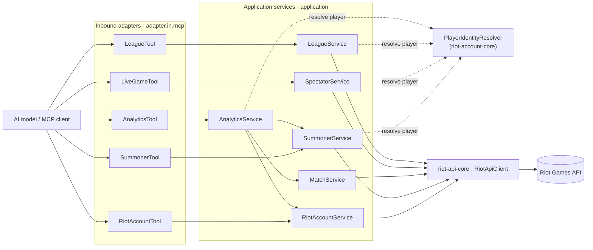

# LoL Parity 1a — Plan D: Per-module docs and the monorepo sanity check

> **For agentic workers:** REQUIRED SUB-SKILL: Use superpowers:subagent-driven-development (recommended) or superpowers:executing-plans to implement this plan task-by-task. Steps use checkbox (`- [ ]`) syntax for tracking.

**Goal:** Give every module (both libraries **and** `lol-mcp-server`) its own `README.md`, `ARCHITECTURE.md`, and `CHANGELOG.md`; shrink the root docs to cross-cutting orientation with no duplicated facts; enforce the per-module doc set with a build gate; and run the sanity-check pass that leaves enforcement behind rather than a verdict — closing sub-project 1a.

**Architecture:** Phase 7 of the [1a spec](../specs/2026-07-15-lol-parity-foundation-design.md). This plan touches **only** docs, the `buildSrc` convention plugin, one ArchUnit test, and the knowledge base — **no production Java changes**. The organizing rule is *a fact lives at exactly one altitude*: cross-cutting facts live at the repo root and are linked from modules; module-specific facts live in the module and are never restated at root. The bar the doc topology must clear: **a consumer who only cares about one module can read that module's docs and stop.** `docs/knowledge/` stays shared and single-source — fragmenting it per module would mean an agent working in a future server misses a gotcha written here, which is exactly backwards.

**Tech Stack:** Gradle 9.6.1 (Groovy DSL, `buildSrc` convention plugin `riot-java-conventions.gradle`), Spring Boot 4.1.0, Spring AI 2.0.0, Java 21, JUnit 5, AssertJ, ArchUnit 1.3.0, Spotless (palantir-java-format), JaCoCo, Keep a Changelog + SemVer (pre-1.0).

## Global Constraints

- **No production Java changes.** Only `docs/`, root `*.md`, per-module `*.md`, `buildSrc/src/main/groovy/riot-java-conventions.gradle`, and `lol-mcp-server/.../architecture/HexagonalArchitectureTest.java` (one dead exception removed) change. If a task seems to need a production-source edit, **stop and record it** — Phase 7 is docs + build config + an arch audit, nothing else.
- **The anti-duplication rule (`a fact lives at exactly one altitude`).** Cross-cutting → root, linked from modules. Module-specific → the module, never at root. The failure mode being designed against is N copies of the hexagon explanation drifting independently. Every doc task is judged against it.
- **Module docs describe only their module.** A module `ARCHITECTURE.md` **links** the shared hexagon rationale at root and never restates it; it covers only what is specific to that module.
- **The suite runs offline with no Riot API key** (standing 1a constraint) — this plan adds no tests that need one; the new gate is a Gradle file-existence check.
- **Green at every commit.** `./gradlew build` runs tests + ArchUnit + JaCoCo + `verifyRelease` + Spotless check. The new `verifyModuleDocs` gate (Task 6) is added **after** all module docs exist (Tasks 2–4), so the build is never red for a missing doc. Run `./gradlew spotlessApply` before committing any Java change (only Task 1 touches Java).
- **`verifyModuleDocs` and `verifyRelease` are per-module convention-plugin gates**, not JUnit tests. They live in `riot-java-conventions.gradle`, run under `check` for each of the three modules, and are proven-to-bite by a documented manual negative check (the same style as the existing `verifyRelease`, which has no automated negative control either). A JUnit test cannot assert the *libraries'* docs exist without a game module reaching across module boundaries; a per-module Gradle gate is the right altitude.
- **All three modules stay at version `0.1.0`.** Doc additions accumulate under each module's existing `## [0.1.0] - unreleased` heading; `verifyRelease` matches the heading, not a date. Repo-wide changes (the doc-topology restructure, the new gate, the removed arch exception) go in the **root** `CHANGELOG.md` per the one rule: *a change is logged in the CHANGELOG of every module whose version it bumps; the root covers changes that bump no module.*
- **Historical `com.wkaiser` narration is legitimate and must not be "fixed".** ADRs, `gotchas.md`, `roadmap.md`, and the frozen pre-split entries in the root `CHANGELOG.md` describe the migration *from* `com.wkaiser` — that is history, correctly recorded. The Task 7 audit targets **live** references only (source, build files, CI), where a stale package would not even compile.
- **Hydrate before starting:** `docs/knowledge/README.md`, `docs/knowledge/roadmap.md`, `docs/knowledge/gotchas.md`, ADR-0006 (monorepo split), ADR-0007 (core boundary), ADR-0008 (identity resolver), ADR-0009 (tool contract), ADR-0010 (versioning/coordinates), and the 1a spec's [Phase 7](../specs/2026-07-15-lol-parity-foundation-design.md#phase-7--docs-and-monorepo-sanity-check).

## What "done" looks like (Phase 7 acceptance)

| Sanity-check item (from the spec) | How this plan discharges it |
|---|---|
| Every module has the full local doc set | Tasks 2–4 create README + ARCHITECTURE (CHANGELOGs already exist); Task 6 **enforces** it with `verifyModuleDocs`. |
| No root doc restates a module fact; no module doc restates a shared one | Tasks 2–5, judged against the anti-duplication rule; audited in Task 7. |
| The convention plugin holds no module-specific values | Task 7 audit (already true since Plan A dropped `version`; confirmed and recorded). |
| `api` vs `implementation` reflects the real public surface after Phases 2–3 | Task 7 audit against the widened core/account surfaces. |
| No `com.wkaiser` reference survives in live source/build/CI | Task 7 scoped grep with documented exclusions. |
| The slice rule holds with league added; the account-domain rule accounts for the resolver's consumers | Task 1 removes the now-dead `spectator→summoner` exception and confirms the negative controls still bite. |
| No ArchUnit rule carries a fully-qualified package in its *condition* | Task 1 audit (already true; the account-domain rule uses relative matchers — confirmed and recorded). |
| Both transports handshake; the tool inventory matches the Phase 6 seven-tool table | Task 8 runs the standing manual verification gates (automation is a deferred roadmap item). |

## File Structure

| File | Responsibility | Task |
|---|---|---|
| `lol-mcp-server/src/test/java/com/muddl/riot/lol/architecture/HexagonalArchitectureTest.java` | Modify — drop the dead `spectator→summoner` slice exception | 1 |
| `riot-api-core/README.md` | Create — what the kernel is, its public API, how to consume, config | 2 |
| `riot-api-core/ARCHITECTURE.md` | Create — internal layout, the HTTP client, the ADR-0007 boundary | 2 |
| `riot-api-core/CHANGELOG.md` | Modify — one Added line for module-local docs | 2 |
| `riot-account-core/README.md` | Create — the account context + resolver, public API, consume, config | 3 |
| `riot-account-core/ARCHITECTURE.md` | Create — layout, the resolver/cache, the no-`@McpTool` rule, the split | 3 |
| `riot-account-core/CHANGELOG.md` | Modify — one Added line for module-local docs | 3 |
| `lol-mcp-server/README.md` | Create — the seven-tool table, run (stdio/sse), Docker, config | 4 |
| `lol-mcp-server/ARCHITECTURE.md` | Create — the LoL contexts, the updated tool diagram, the slice rule as applied | 4 |
| `lol-mcp-server/CHANGELOG.md` | Modify — one Added line for module-local docs | 4 |
| `README.md` (root) | Rewrite — orientation only: what the monorepo is, module table, dependency rule, build, links out | 5 |
| `ARCHITECTURE.md` (root) | Modify — generalize the LoL-specific bounded-context + enforcement-exception detail into pointers | 5 |
| `buildSrc/src/main/groovy/riot-java-conventions.gradle` | Modify — add the `verifyModuleDocs` gate, wired into `check` | 6 |
| `CHANGELOG.md` (root) | Modify — a sub-project 1a Plan D section for the repo-wide changes | 6, 7, 8 |
| `docs/knowledge/decisions/ADR-0011-doc-topology.md` | Create — per-module docs, the one-altitude rule, the `verifyModuleDocs` gate | 8 |
| `docs/knowledge/README.md` | Modify — index ADR-0011 | 8 |
| `docs/knowledge/patterns/add-a-bounded-context.md` | Modify — a new server module must carry README/ARCHITECTURE/CHANGELOG or `verifyModuleDocs` fails | 8 |
| `docs/knowledge/gotchas.md` | Modify — record the arch audit finding (unused `ignoreDependency` when a composition edge dies) | 8 |
| `docs/knowledge/roadmap.md` | Modify — mark Plan D complete and sub-project 1a done | 8 |
| `CONTRIBUTING.md` (root) | Modify — the module table gains league; point to module docs | 5 |

---

## Task 1: ArchUnit audit — remove the now-dead `spectator→summoner` slice exception

Plan C moved spectator to Spectator-V5 (PUUID-keyed) and deleted the two by-name spectator tools, which removed `LiveGameTool`'s only dependency on `SummonerService`. The `spectator → summoner` exception in `contexts_do_not_depend_on_each_other` is therefore unused — Plan C's own note deferred removing it to "Plan D's arch-audit job (Phase 7)." An unused `ignoreDependency` is harmless (it fails nothing), so this is a cleanliness fix, not a correctness one; the value is that the rule's exception list becomes an honest statement of the real composition graph. This task also **audits and records** the two remaining sanity-check items about ArchUnit — that the slice rule holds with league added, and that no rule carries a fully-qualified package in its *condition* — both of which are already true and need confirming, not changing.

**Files:**
- Modify: `lol-mcp-server/src/test/java/com/muddl/riot/lol/architecture/HexagonalArchitectureTest.java`

**Interfaces:**
- Consumes: nothing new.
- Produces: `contexts_do_not_depend_on_each_other` retains exactly two exceptions — `analytics→summoner`, `analytics→match`.

- [ ] **Step 1: Prove the `spectator→summoner` edge is actually gone (evidence before deletion)**

Confirm no spectator production class references summoner, so removing the exception cannot turn the rule red:

```bash
grep -rn "summoner" lol-mcp-server/src/main/java/com/muddl/riot/lol/spectator/ || echo "NO SPECTATOR->SUMMONER REFERENCE — exception is dead"
```

Expected: prints `NO SPECTATOR->SUMMONER REFERENCE — exception is dead` (no matches). If any match appears, **stop** — the edge is live and the exception must stay; record that as a finding instead.

- [ ] **Step 2: Remove the dead exception**

In `HexagonalArchitectureTest.java`, delete the `spectator → summoner` line from `contexts_do_not_depend_on_each_other` so it reads:

```java
    @ArchTest
    static final ArchRule contexts_do_not_depend_on_each_other = slices().matching("..riot.lol.(*)..")
            .should()
            .notDependOnEachOther()
            .ignoreDependency(resideInAPackage("..lol.analytics.."), resideInAPackage("..lol.summoner.."))
            .ignoreDependency(resideInAPackage("..lol.analytics.."), resideInAPackage("..lol.match.."));
```

Update the rule's javadoc to state the current exceptions (the class javadoc block above the field mentions "three deliberate composition edges" — change "three" to "two" and, if it enumerates them, list only `analytics→summoner` and `analytics→match`):

```java
    /**
     * Contexts are independent except for two deliberate composition edges. This replaces the
     * hand-maintained N-by-N matrix that preceded it: one rule that stays correct as contexts are
     * added, rather than one rule per context each enumerating every other.
     * <p>
     * The edges are analytics -> summoner and analytics -> match: analytics composes those two
     * contexts' application services. The spectator -> summoner edge was retired in Plan C, which
     * moved spectator to Spectator-V5 (PUUID-keyed) and dropped its by-name tools — removing
     * LiveGameTool's dependency on SummonerService.
     * <p>
     * analytics -> account needs no exception here: RiotAccountService lives in
     * com.muddl.riot.account (riot-account-core), outside this matcher. That same fact is why
     * {@link #only_analytics_and_the_account_tool_use_the_account_domain} exists — see below.
     */
```

- [ ] **Step 3: Confirm the slice rule and both negative controls still pass (league is in scope)**

```bash
./gradlew :lol-mcp-server:test --tests '*HexagonalArchitectureTest*' --tests '*HexagonalArchitectureNegativeControlTest*'
```

Expected: PASS. `contexts_do_not_depend_on_each_other` is green with league present (the `league` slice depends on no other LoL context), and `HexagonalArchitectureNegativeControlTest` still shows the account-domain rule rejects an illegal domain user and allows a legal resolver user — i.e. the rule still bites on both halves.

- [ ] **Step 4: Audit — no ArchUnit rule carries a fully-qualified package in its condition**

This is a confirm-and-record step (the fix landed in Plan A/B; Phase 7 verifies it stuck). The account-domain rule's condition uses relative matchers (`..riot.account..`, `..riot.account.identity..`), which is what prevents the vacuous-pass failure mode. Confirm no `com.muddl` string appears inside a rule *condition*:

```bash
grep -n "com.muddl" lol-mcp-server/src/test/java/com/muddl/riot/lol/architecture/HexagonalArchitectureTest.java \
                    riot-api-core/src/testFixtures/java/com/muddl/riot/core/testsupport/HexagonRules.java
```

Expected: **only** the `@AnalyzeClasses(packages = "com.muddl.riot.lol")` scan root (a selector, whose failure is loud, not a condition) — and no fully-qualified `com.muddl.*` inside any `.dependOnClassesThat(...)` / `.resideInAPackage(...)` **condition**. The one legitimate fully-qualified name is `org.springframework.web.client.RestClient` in `RESTCLIENT_CONFINED_TO_OUTBOUND_ADAPTERS` (a third-party type, not a group-dependent package — correct). Note the result for Task 8's gotcha entry.

- [ ] **Step 5: Full module build — green**

```bash
./gradlew spotlessApply && ./gradlew :lol-mcp-server:build
```

Expected: `BUILD SUCCESSFUL`.

- [ ] **Step 6: Commit**

```bash
git add lol-mcp-server/src/test/java/com/muddl/riot/lol/architecture/HexagonalArchitectureTest.java
git commit -m "test(arch): drop the dead spectator->summoner slice exception

Plan C moved spectator to Spectator-V5 and removed its by-name tools, which
removed LiveGameTool's dependency on SummonerService. The ignoreDependency for
spectator->summoner has been unused since; removing it makes the rule's
exception list an honest statement of the real composition graph
(analytics->summoner, analytics->match). Negative controls still bite.

Co-Authored-By: Claude Opus 4.8 <noreply@anthropic.com>
Claude-Session: https://claude.ai/code/session_019XWxSq1xSyRYXSrFAhCyje"
```

---

## Task 2: `riot-api-core` module docs

The shared HTTP kernel is the module a future server author reads first. Its docs describe **only** the kernel — the hexagon rationale is shared and stays at root, linked. Both files are new; the CHANGELOG exists and gains one line.

**Files:**
- Create: `riot-api-core/README.md`
- Create: `riot-api-core/ARCHITECTURE.md`
- Modify: `riot-api-core/CHANGELOG.md`

**Interfaces:**
- Consumes: the public surface confirmed in `riot-api-core/build.gradle` and `RiotApiProperties` (config keys: `api-key`, `region`, `base-url-override`, `max-retries`, `retry-backoff`, `max-retry-backoff`).
- Produces: the two module docs `verifyModuleDocs` (Task 6) will require.

- [ ] **Step 1: Write `riot-api-core/README.md`**

```markdown
# `riot-api-core`

The shared Riot HTTP kernel for every server in this monorepo: one place for HTTP, auth, retry, and
Riot's error protocol. It knows **nothing** about any game's domain — no League, TFT, or Valorant
DTO lives here (that boundary is [ADR-0007](../docs/knowledge/decisions/ADR-0007-core-hardening-boundary.md)).

Consumed by every other module via a Gradle project reference and Spring auto-configuration; it is
versioned for provenance but **not published** as a Maven artifact (see
[ADR-0010](../docs/knowledge/decisions/ADR-0010-versioning-and-coordinates.md)).

## Public API

- **`RiotApiClient`** (`com.muddl.riot.core.http`) — the only HTTP entry point. Two pre-configured
  `RestClient` factories, split by Riot's two host families:

  ```java
  RestClient regional(RiotApiRegionUri region);     // account, match — region-routed
  RestClient platform(RiotApiPlatformUri platform);  // summoner, spectator, league — platform-routed
  ```

  Each returned client already carries the `X-RIOT-TOKEN` header, the assembled base URL, automatic
  retry on HTTP 429 (honouring `Retry-After`), and a status handler that maps any non-2xx response
  to `RiotApiException`.

- **`RiotApiException`** (`com.muddl.riot.core.exception`) — `getStatusCode()` and an actionable,
  status-derived message (e.g. a 403 explains that development keys expire every 24 hours). The raw
  Riot body is still reachable via `getRawBody()`.

- **Routing enums** (`com.muddl.riot.core.enums`) — `RiotApiRegionUri` (`AMERICAS`, `EUROPE`,
  `ASIA`, `SEA`) and `RiotApiPlatformUri` (`NA1`, `EUW1`, `KR`, …). Picking the wrong family yields
  a 404 from Riot, so the split makes the correct choice a compile-time decision.

- **`RiotApiProperties`** (`com.muddl.riot.core.config`) — typed `riot.*` configuration (below).

## Consuming it

Add the project reference; auto-configuration (`RiotApiAutoConfiguration`) registers `RiotApiClient`
and `RiotApiProperties`. No component scanning, no package coupling.

```groovy
dependencies {
    implementation project(':riot-api-core')
}
```

## Configuration

Bound from the `riot.*` namespace (`RiotApiProperties`):

| Property | Env / default | Purpose |
|---|---|---|
| `riot.api-key` | `RIOT_API_KEY` | Riot API key; sent as `X-RIOT-TOKEN`. Never logged. |
| `riot.region` | `AMERICAS` | Default region for region-routed endpoints. |
| `riot.base-url-override` | *(unset)* | Points every client at a given base URL — how tests hit a local mock server. |
| `riot.max-retries` | `3` | Attempts on HTTP 429 before surfacing the error. |
| `riot.retry-backoff` | `1s` | Backoff when a 429 carries no usable `Retry-After`. |
| `riot.max-retry-backoff` | `120s` | Upper bound on a single 429 wait, even if `Retry-After` asks for longer. |

## Architecture

The shared hexagon rationale lives at the [repository root](../ARCHITECTURE.md). This module's own
internals — the HTTP client, the error taxonomy, the deliberately held boundary — are in
[ARCHITECTURE.md](ARCHITECTURE.md).

## Build and test

Part of the monorepo; there is no standalone build.

```bash
./gradlew :riot-api-core:test          # this module's tests (WireMock, offline, no key)
./gradlew build                        # the whole-repo CI gate
```
```

- [ ] **Step 2: Write `riot-api-core/ARCHITECTURE.md`**

```markdown
# `riot-api-core` — Architecture

This module is the monorepo's **shared kernel**: it owns HTTP and Riot's error protocol and nothing
game-specific. The bounded-context hexagon that every *server* is built from is described once at the
[repository root](../ARCHITECTURE.md) — this document does not restate it; it covers only what is
particular to the kernel.

## Internal layout

```
com.muddl.riot.core
├── config/        RiotApiProperties, RiotApiAutoConfiguration
├── enums/         RiotApiRegionUri, RiotApiPlatformUri
├── exception/     RiotApiException
├── http/          RiotApiClient — all HTTP/auth/retry/error handling
└── (testFixtures) HexagonRules, Fixtures — shared across every module's tests
```

## The HTTP client

`RiotApiClient` is the single seam between our code and Riot. It exposes `regional(...)` and
`platform(...)` `RestClient` factories; each returned client carries the `X-RIOT-TOKEN` header (from
typed `RiotApiProperties`), the assembled base URL (`https://<host>` in production, or
`base-url-override` when set), automatic 429 retry, and a status handler mapping non-2xx to
`RiotApiException(message, statusCode)`. This replaced what used to be copy-pasted into four
services (a private client factory, the header constant, a `@Value("${riot.apiKey}")`, a
near-identical `try/catch`).

## Retry, not a rate limiter

429 handling is **reactive**: it honours Riot's `Retry-After` header, falls back to `retry-backoff`
when the header is absent, bounds attempts by `max-retries`, and caps any single wait at
`max-retry-backoff` so a hostile or erroneous header cannot stall a thread. It is deliberately **not**
a proactive token-bucket limiter — that needs a real design (per-method limits, shared buckets,
concurrency) and would be guessing at this stage. See
[ADR-0007](../docs/knowledge/decisions/ADR-0007-core-hardening-boundary.md).

## The error taxonomy

`RiotApiException` carries an actionable, status-derived message; the raw Riot body moves off the
message and onto `getRawBody()`. The intended consumer is a third party installing against their own
key, and a clear 403/404/429/503 message is most of the difference between a good and a bad install
experience.

## The boundary, held deliberately

The kernel knows about **HTTP and Riot's error protocol**, never a game's domain. League's DTOs stay
in `lol-mcp-server`. [ADR-0006](../docs/knowledge/decisions/ADR-0006-monorepo-split.md) warned about
core becoming a junk drawer; ADR-0007 exists to hold this line, and the sub-project 1a sanity pass
audits it (`api` vs `implementation`, no game type leaking in).

## Shared test fixtures

`riot-api-core`'s `testFixtures` source set holds `HexagonRules` (the ArchUnit rule set every
module's architecture test declares) and `Fixtures` (canned-JSON loading). A new game server
inherits the architecture rules instead of copy-pasting them — see the root
[Enforcement](../ARCHITECTURE.md#enforcement) section.
```

- [ ] **Step 3: Add the CHANGELOG line**

In `riot-api-core/CHANGELOG.md`, under `## [0.1.0] - unreleased`'s `### Added` list, append:

```markdown
- Module-local `README.md` and `ARCHITECTURE.md` — the kernel's public API and internals now
  document themselves, so a consumer of just this module can read its docs and stop (sub-project 1a
  Phase 7).
```

- [ ] **Step 4: Build — green (docs don't affect compilation; `verifyRelease` still matches the heading)**

```bash
./gradlew :riot-api-core:build
```

Expected: `BUILD SUCCESSFUL`.

- [ ] **Step 5: Commit**

```bash
git add riot-api-core/README.md riot-api-core/ARCHITECTURE.md riot-api-core/CHANGELOG.md
git commit -m "docs(riot-api-core): module-local README and ARCHITECTURE

The shared HTTP kernel now documents its own public API, config, and internals.
Cross-cutting hexagon rationale stays at root and is linked, not restated
(sub-project 1a Phase 7, the one-altitude rule).

Co-Authored-By: Claude Opus 4.8 <noreply@anthropic.com>
Claude-Session: https://claude.ai/code/session_019XWxSq1xSyRYXSrFAhCyje"
```

---

## Task 3: `riot-account-core` module docs

The cross-game account context plus the shared `PlayerIdentityResolver`. Its docs describe the two-altitude confinement (the account **domain** is deny-by-default; identity resolution is open) since that is specific to this module's ArchUnit split — but link the shared hexagon at root.

**Files:**
- Create: `riot-account-core/README.md`
- Create: `riot-account-core/ARCHITECTURE.md`
- Modify: `riot-account-core/CHANGELOG.md`

**Interfaces:**
- Consumes: the public surface confirmed in `riot-account-core/build.gradle` (`api project(':riot-api-core')`, `implementation caffeine`) and ADR-0008.
- Produces: the two module docs `verifyModuleDocs` (Task 6) will require.

- [ ] **Step 1: Write `riot-account-core/README.md`**

```markdown
# `riot-account-core`

The cross-game **account-v1** context and the shared **player-identity resolver**. account-v1 is not
game-specific (a Riot account spans League, TFT, and Valorant), so it lives in its own library that
every game server consumes. It ships **no `@McpTool`** by design — each server owns its own inbound
adapter so tool names can be namespaced per game and never collide inside an MCP client.

Consumed via a Gradle project reference and Spring auto-configuration; versioned for provenance but
**not published** (see [ADR-0010](../docs/knowledge/decisions/ADR-0010-versioning-and-coordinates.md)).

## Public API

- **`PlayerIdentityResolver`** (`com.muddl.riot.account.identity`) — the open, cross-cutting surface
  every player-keyed context depends on:

  ```java
  String resolvePuuid(String player);  // accepts "GameName#TAG" or a raw PUUID → returns a PUUID
  ```

  Riot IDs (`GameName#TAG`) are mutable, so the resolver caches `Riot ID → PUUID` in a bounded,
  TTL-expiring cache; a raw PUUID passes straight through. It returns a **plain PUUID string**, not a
  `RiotAccount`, so depending on it does not open the account domain. See
  [ADR-0008](../docs/knowledge/decisions/ADR-0008-shared-player-identity-resolution.md).

- **`RiotAccountService`** (`com.muddl.riot.account.application`) — account data by PUUID or Riot ID,
  over `RiotAccountPort`. Reaching for account **data** (not just a PUUID) is deny-by-default: only a
  server's `analytics` and `account` contexts may depend on it.

- **`RiotAccount`** (`com.muddl.riot.account.domain`) — the account DTO.

## Consuming it

```groovy
dependencies {
    implementation project(':riot-account-core')  // transitively brings riot-api-core
}
```

Auto-configuration (`RiotAccountAutoConfiguration`) registers the service and the resolver; a server
gets them by declaring the dependency and nothing else.

## Configuration

Inherits the `riot.*` configuration from [`riot-api-core`](../riot-api-core/README.md#configuration)
(the API key and routing). The resolver's cache is bounded and TTL-expiring on an injected ticker —
see [ADR-0008](../docs/knowledge/decisions/ADR-0008-shared-player-identity-resolution.md).

## Architecture

Shared hexagon rationale: [repository root](../ARCHITECTURE.md). This module's own internals — the
resolver, the cache, the two-altitude confinement — are in [ARCHITECTURE.md](ARCHITECTURE.md).

## Build and test

```bash
./gradlew :riot-account-core:test      # port-fake + WireMock tests, offline, no key
./gradlew build                        # the whole-repo CI gate
```
```

- [ ] **Step 2: Write `riot-account-core/ARCHITECTURE.md`**

```markdown
# `riot-account-core` — Architecture

The one cross-game **domain** context, extracted into its own library. It is a bounded context, not
infrastructure — which is exactly why it is its own module rather than part of `riot-api-core`. The
shared bounded-context hexagon is described at the [repository root](../ARCHITECTURE.md); this
document covers only what is specific to the account library.

## Internal layout

```
com.muddl.riot.account
├── domain/            RiotAccount
├── application/       RiotAccountService
├── application/port/  RiotAccountPort
├── adapter/out/riot/  RiotAccountRiotAdapter
├── identity/          PlayerIdentityResolver  (the open, cross-cutting surface)
└── config/            RiotAccountAutoConfiguration
```

There is **no `adapter/in/mcp/`** here, by design (below).

## The identity resolver

`PlayerIdentityResolver.resolvePuuid(String)` disambiguates its argument on the `#`: a `GameName#TAG`
is resolved through account-v1; a raw PUUID passes through untouched. Because Riot IDs are mutable
but PUUIDs are stable, it caches `Riot ID → PUUID` in a bounded, TTL-expiring Caffeine cache on an
**injected ticker** (so tests are deterministic and fast — no real sleeps). This is the first
stateful thing in the codebase: bounded size, TTL, injected clock, no cross-request assumptions. See
[ADR-0008](../docs/knowledge/decisions/ADR-0008-shared-player-identity-resolution.md).

It returns a **plain PUUID string, not a `RiotAccount`** — a deliberate choice. If it returned an
account, every context that resolved a player would touch the account domain through the return type,
defeating the confinement rule through the back door.

## Two altitudes, one library

This library holds two things the rest of the monorepo treats differently:

- **The account domain** (`RiotAccount`, `RiotAccountService`) — genuinely a bounded context.
  **Deny-by-default:** only a server's `analytics` and `account` contexts may depend on it.
- **Identity resolution** (`PlayerIdentityResolver`) — deliberately cross-cutting; every
  player-keyed context is *supposed* to depend on it.

A server enforces this split with a single ArchUnit rule that confines `..riot.account..` but
excludes `..riot.account.identity..` — see the root
[Enforcement](../ARCHITECTURE.md#enforcement) section and, in `lol-mcp-server`, the negative-control
test that proves both halves still bite.

## No `@McpTool`

Enforced by `AccountArchitectureTest`'s `no_mcp_tools_in_this_library`. account-v1 is cross-game: a
tool declared here would appear, identically named, in every installed game server and collide inside
the MCP client. Each server owns a thin inbound `account` adapter of its own instead.
```

- [ ] **Step 3: Add the CHANGELOG line**

In `riot-account-core/CHANGELOG.md`, under `## [0.1.0] - unreleased`'s `### Added` list, append:

```markdown
- Module-local `README.md` and `ARCHITECTURE.md` — the account context and the identity resolver's
  public API and internals now document themselves (sub-project 1a Phase 7).
```

- [ ] **Step 4: Build — green**

```bash
./gradlew :riot-account-core:build
```

Expected: `BUILD SUCCESSFUL`.

- [ ] **Step 5: Commit**

```bash
git add riot-account-core/README.md riot-account-core/ARCHITECTURE.md riot-account-core/CHANGELOG.md
git commit -m "docs(riot-account-core): module-local README and ARCHITECTURE

The account context and the shared PlayerIdentityResolver now document their
public API, the two-altitude confinement, and the no-@McpTool rule. Hexagon
rationale linked at root (sub-project 1a Phase 7).

Co-Authored-By: Claude Opus 4.8 <noreply@anthropic.com>
Claude-Session: https://claude.ai/code/session_019XWxSq1xSyRYXSrFAhCyje"
```

---

## Task 4: `lol-mcp-server` module docs

The server's README absorbs the seven-tool table, the run instructions, and the Docker section that currently sit at the repo root (they are server-specific and must move down under the one-altitude rule). Its ARCHITECTURE holds the LoL bounded-context list, the updated tool diagram, and the slice rule *as applied to this server* — all of which are LoL-specific and must not sit at root.

**Files:**
- Create: `lol-mcp-server/README.md`
- Create: `lol-mcp-server/ARCHITECTURE.md`
- Modify: `lol-mcp-server/CHANGELOG.md`

**Interfaces:**
- Consumes: the seven-tool contract from [ADR-0009](../../knowledge/decisions/ADR-0009-mcp-tool-contract.md) and Plan C's final inventory; the current root `README.md` tool table, quick-start, and Docker sections (moved here verbatim-then-trimmed).
- Produces: the two module docs `verifyModuleDocs` (Task 6) will require; the content the root README (Task 5) will link to instead of restating.

- [ ] **Step 1: Write `lol-mcp-server/README.md`**

```markdown
# `lol-mcp-server`

The League of Legends MCP server: a Spring Boot app that exposes the Riot LoL API to AI models as a
small set of typed [MCP](https://modelcontextprotocol.io) tools. Published as
`ghcr.io/muddl/lol-mcp-server`.

It is built on the two shared libraries — [`riot-api-core`](../riot-api-core/README.md) (HTTP,
routing, errors) and [`riot-account-core`](../riot-account-core/README.md) (the account context and
the player-identity resolver) — and adds the LoL-specific bounded contexts.

## MCP tools

Five inbound adapters expose **seven** tools. Every player-keyed tool takes a single `player`
parameter accepting either a Riot ID (`GameName#TAG`) or a raw PUUID, resolved internally — the model
never has to chain `account → summoner → match` itself (see
[ADR-0009](../docs/knowledge/decisions/ADR-0009-mcp-tool-contract.md)).

| Tool class (`adapter.in.mcp`) | MCP tool names | Purpose |
|---|---|---|
| **RiotAccountTool** | `lol_account_by_player` | Riot account by player |
| **SummonerTool** | `lol_summoner_by_player` | Summoner profile by player |
| **LiveGameTool** | `lol_spectator_current_game_by_player`, `lol_spectator_featured_games` | Live-game (Spectator-V5) data; `null` when not in a game |
| **AnalyticsTool** | `lol_analytics_player_matches` | Aggregated recent-match analytics (composes account + summoner + match) |
| **LeagueTool** | `lol_league_entries_by_player`, `lol_league_apex_by_tier` | Ranked entries by player; apex league (CHALLENGER/GRANDMASTER/MASTER) by tier + queue |

## Quick start

Prerequisites: **Java 21** and a **Riot API key** (a development key from
<https://developer.riotgames.com/>). No Anthropic key or any other credential is needed to build,
test, or run.

```bash
export RIOT_API_KEY="RGAPI-your-key-here"

# stdio (default) — what local MCP clients expect; the client spawns the process and talks
# JSON-RPC over its stdin/stdout
./gradlew :lol-mcp-server:bootRun

# ...or over SSE, for a client that connects over HTTP
./gradlew :lol-mcp-server:bootRun --args='--spring.profiles.active=sse'
```

Over `sse`, the server starts on `http://localhost:8080`; the MCP message endpoint is
`/mcp/messages`, and liveness is `curl http://localhost:8080/actuator/health`. Over `stdio` there is
no port — `application-stdio.yml` disables the banner and console logging so nothing but protocol
frames reaches stdout (see [`docs/knowledge/gotchas.md`](../docs/knowledge/gotchas.md) before
touching stdio logging).

## Docker

A multi-stage `Dockerfile` (at the repo root) builds one server module on a slim JRE 21, selected via
`--build-arg SERVER_MODULE=` (default `lol-mcp-server` — one image per game server). The container
reads `RIOT_API_KEY` and always runs the `sse` profile (a container has no controlling terminal for
`stdio` to spawn into).

```bash
docker build -t lol-mcp-server .
docker run --rm -p 8080:8080 -e RIOT_API_KEY="RGAPI-your-key-here" lol-mcp-server
```

Tagging a release publishes the image to `ghcr.io/muddl/lol-mcp-server` via `release.yml`.

## Architecture

Shared hexagon rationale: [repository root](../ARCHITECTURE.md). This server's own contexts, their
boundaries, and its slice rule are in [ARCHITECTURE.md](ARCHITECTURE.md).

## Testing

Tests run **offline with no Riot API key** — CI proves it. Outbound adapters run against local
[WireMock](https://wiremock.org/) (asserting URL, `X-RIOT-TOKEN`, JSON→DTO parsing, and error
mapping including the spectator `404 → null` rule); application services run against in-memory port
fakes.

```bash
./gradlew :lol-mcp-server:test    # this module's tests
./gradlew build                   # the whole-repo CI gate
```
```

- [ ] **Step 2: Write `lol-mcp-server/ARCHITECTURE.md`**

```markdown
# `lol-mcp-server` — Architecture

This server is a set of League of Legends **bounded contexts** under `com.muddl.riot.lol`, each a
ports-and-adapters hexagon. The shared hexagon shape, the dependency rule, the HTTP client, routing,
and the enforcement mechanisms are described once at the [repository root](../ARCHITECTURE.md) — this
document covers only what is specific to the LoL server.

## Bounded contexts

```
com.muddl.riot.lol
├── account/     Thin @McpTool only — the real context lives in riot-account-core (platform N/A)
├── summoner/    Summoner profiles (platform-routed)
├── match/        Match IDs and detail (region-routed); no MCP tool — consumed only by analytics
├── spectator/   Live-game / featured-game data, Spectator-V5, PUUID-keyed (platform-routed)
├── analytics/   Composing context — aggregates account + summoner + match; has no Riot adapter
└── league/      Ranked entries + apex leagues, League-V4 (platform-routed) — the exemplar context
```

Two contexts are deliberate exceptions to the standard hexagon shape:

- **`analytics`** has `domain/`, an `application/` service (depending on the account/summoner/match
  application services), and an `adapter/in/mcp/` tool — but **no** `adapter/out/riot` and no port,
  because it makes no direct Riot calls.
- **`match`** is the mirror: a port and an outbound adapter but **no** inbound tool, because it is
  consumed only by `analytics` (exposing it directly is sub-project 1b's mechanical add-a-tool work).

`league` is the **reference implementation** the remaining 1b contexts copy: a full mini-hexagon,
born on the final tool-naming convention, and the first LoL context to depend on
`PlayerIdentityResolver`.

## Tools and the `player` parameter

Every player-keyed tool takes a single `player` param (`GameName#TAG` or a raw PUUID) and is named
`lol_<context>_<action>`. Resolution happens in the **application service** via
`PlayerIdentityResolver` (from `riot-account-core`) — tools stay thin pass-throughs. The one
exception is the `account` tool, which disambiguates `#` locally because it needs account **data**
both ways and must not round-trip through the resolver. See
[ADR-0009](../docs/knowledge/decisions/ADR-0009-mcp-tool-contract.md).



(Outbound ports and `Riot<Context>Adapter` implementations are omitted from the diagram for
readability — each service depends on its own `<Context>Port`, implemented by a Riot adapter, exactly
as the [root dependency rule](../ARCHITECTURE.md#the-dependency-rule) describes.)

## Context independence, as applied here

`contexts_do_not_depend_on_each_other` (in `HexagonalArchitectureTest`) allows exactly two
composition edges — **`analytics → summoner`** and **`analytics → match`** — because `analytics`
composes those services. Every other cross-context reference fails the build. (`spectator → summoner`
was retired when spectator moved to Spectator-V5 and dropped its by-name tools.)

Account-domain usage is a separate, additional rule
(`only_analytics_and_the_account_tool_use_the_account_domain`): only `analytics` and this server's
thin `account` tool may reach the account **domain** (`..riot.account..`); identity resolution
(`..riot.account.identity..`) is open to every context. A negative-control test proves both halves
still bite. The mechanism behind both rules is described at the root
[Enforcement](../ARCHITECTURE.md#enforcement) section.

## Routing

Summoner, spectator, and league are **platform**-routed (`riotApiClient.platform(...)`); account and
match are **region**-routed (`riotApiClient.regional(...)`). The enum split makes the correct choice a
compile-time decision — see the root [routing section](../ARCHITECTURE.md#regional-vs-platform-routing).
```

- [ ] **Step 3: Add the CHANGELOG line**

In `lol-mcp-server/CHANGELOG.md`, under `## [0.1.0] - unreleased`'s `### Added` list, append:

```markdown
- Module-local `README.md` and `ARCHITECTURE.md` — the seven-tool surface, run/Docker instructions,
  the LoL bounded contexts, and the updated tool diagram now live with the server (moved down from
  the repo root under the one-altitude rule; sub-project 1a Phase 7).
```

- [ ] **Step 4: Build — green**

```bash
./gradlew :lol-mcp-server:build
```

Expected: `BUILD SUCCESSFUL`.

- [ ] **Step 5: Commit**

```bash
git add lol-mcp-server/README.md lol-mcp-server/ARCHITECTURE.md lol-mcp-server/CHANGELOG.md
git commit -m "docs(lol-mcp-server): module-local README and ARCHITECTURE

The seven-tool table, run and Docker instructions, the LoL bounded contexts,
and the updated tool diagram now live with the server. Root will link to these
instead of restating them (sub-project 1a Phase 7, the one-altitude rule).

Co-Authored-By: Claude Opus 4.8 <noreply@anthropic.com>
Claude-Session: https://claude.ai/code/session_019XWxSq1xSyRYXSrFAhCyje"
```

---

## Task 5: Shrink the root docs to cross-cutting orientation

The root now duplicates what the module docs (Tasks 2–4) own: the LoL tool table, run/Docker instructions, and the LoL-specific bounded-context enumeration. Under the one-altitude rule, root keeps only orientation — what the monorepo is, the module table, the dependency rule, how to build — and links out. This also fixes two staleness bugs: root docs omit the `league` context and still list the dead `spectator→summoner` slice exception.

**Files:**
- Rewrite: `README.md`
- Modify: `ARCHITECTURE.md`
- Modify: `CONTRIBUTING.md`

**Interfaces:**
- Consumes: the module docs created in Tasks 2–4 (linked, not restated); the final arch state from Task 1.
- Produces: a root doc set that names no module-specific fact — the property the Task 7 audit checks.

- [ ] **Step 1: Rewrite `README.md` to orientation only**

Replace the entire file with:

```markdown
# Riot API MCP Server

[](https://github.com/Muddl/riot-api-mcp-server/actions/workflows/ci.yml)
[](https://openjdk.org/projects/jdk/21/)
[](https://spring.io/projects/spring-boot)
[](LICENSE)

A Gradle monorepo of [Model Context Protocol](https://modelcontextprotocol.io) (MCP) servers that
expose the [Riot Games API](https://developer.riotgames.com/) to AI models as small, typed toolsets —
two shared libraries plus one Spring Boot server per Riot game (currently League of Legends). It is a
**portfolio piece**: the point is the engineering — a clean bounded-context hexagonal architecture, a
single shared HTTP client, HTTP-mocked tests that run in CI with no API key, and architecture rules
enforced at build time (some by ArchUnit, some by Gradle's module graph itself).

## Modules

| Module | What it is | Docs |
|---|---|---|
| [`riot-api-core`](riot-api-core/README.md) | Shared Riot HTTP kernel — `RiotApiClient`, routing enums, `RiotApiException`, config | [README](riot-api-core/README.md) · [ARCHITECTURE](riot-api-core/ARCHITECTURE.md) |
| [`riot-account-core`](riot-account-core/README.md) | Cross-game account context + the player-identity resolver | [README](riot-account-core/README.md) · [ARCHITECTURE](riot-account-core/ARCHITECTURE.md) |
| [`lol-mcp-server`](lol-mcp-server/README.md) | The League of Legends MCP server (seven tools; stdio + sse) | [README](lol-mcp-server/README.md) · [ARCHITECTURE](lol-mcp-server/ARCHITECTURE.md) |

**Dependency rule:** `lol-mcp-server` → `riot-account-core` → `riot-api-core`, never back — enforced
by Gradle at compile time (a library simply has no dependency on a game module). Each Riot context
inside a server is a self-contained hexagon: an inbound MCP adapter calls an application service,
which depends on an outbound **port** implemented by a Riot adapter; all HTTP, auth, retry, and error
handling live in one place, `riot-api-core`'s `RiotApiClient`. See
**[ARCHITECTURE.md](ARCHITECTURE.md)** for the full rationale and
[ADR-0006](docs/knowledge/decisions/ADR-0006-monorepo-split.md) for why the monorepo split happened.

## Quick start

Prerequisites: **Java 21** and, only to *run* a server, a **Riot API key** (a development key from
<https://developer.riotgames.com/>). No key is needed to build or test — the suite is fully offline.

```bash
./gradlew build          # compile + all tests + ArchUnit + JaCoCo + Spotless — the CI gate
```

To run a server, see its README — e.g. [`lol-mcp-server`](lol-mcp-server/README.md#quick-start) for
the stdio/sse commands and the Docker image.

## Testing

Tests run **offline with no Riot API key** — CI proves it. Outbound adapters are exercised against a
local [WireMock](https://wiremock.org/) server; application services against in-memory port fakes.
Architecture, coverage, and formatting are checked in the same run.

```bash
./gradlew test           # tests only
./gradlew spotlessApply  # auto-format sources (run before committing)
```

## Documentation

| Document | Purpose |
|---|---|
| **[ARCHITECTURE.md](ARCHITECTURE.md)** | Shared hexagonal design, the dependency rule, routing, enforcement, testing strategy, transports |
| **[CONTRIBUTING.md](CONTRIBUTING.md)** | Build/test/format commands, conventions, how to add a context or tool |
| **[CLAUDE.md](CLAUDE.md)** | Guidance for AI coding agents working in this repo |
| **Per-module READMEs** | [`riot-api-core`](riot-api-core/README.md) · [`riot-account-core`](riot-account-core/README.md) · [`lol-mcp-server`](lol-mcp-server/README.md) |
| **[docs/knowledge/](docs/knowledge/)** | Committed knowledge base — ADRs, patterns, gotchas, glossary, roadmap |

## License

Released under the MIT License — see [LICENSE](LICENSE).
```

- [ ] **Step 2: Generalize the LoL-specific detail out of `ARCHITECTURE.md`**

Root `ARCHITECTURE.md` keeps everything cross-cutting (why hexagonal, the generic per-context shape, the dependency rule + mermaid, the shared HTTP client, routing, enforcement mechanism, testing strategy, transports). Two sections currently restate LoL-specific facts and must become pointers:

**(a) The "Bounded contexts" section.** It enumerates the LoL contexts (`account/summoner/match/spectator/analytics`, missing `league`) and the analytics/match asymmetries — all LoL-specific. Replace the LoL-specific enumeration with the generic shape plus a pointer, keeping the generic `<context>/` template that every server follows. Replace the section body (the two code fences listing `com.muddl.riot.lol` contexts and the per-context tree, plus the analytics/match asymmetry paragraph) with:

```markdown
## Bounded contexts

Every Riot context in a server has the same internal shape:

```
<context>/
├── domain/                         relocated Lombok DTOs (no framework imports)
├── application/
│   ├── <Context>Service            application service — pure orchestration logic
│   └── port/<Context>Port          outbound port (interface) — the boundary
└── adapter/
    ├── in/mcp/<Context>Tool        inbound adapter — @McpTool entry points
    └── out/riot/Riot<Context>Adapter   outbound adapter — implements the port with RestClient
```

Two shapes recur as deliberate exceptions: a **composing** context (an application service that
depends on other contexts' services, with an inbound tool but no port or Riot adapter of its own),
and a **tool-less** context (a port and adapter consumed only by a composing context, with no inbound
tool). A server's own context list — including which contexts take which shape — lives in that
server's ARCHITECTURE, e.g. [`lol-mcp-server`](lol-mcp-server/ARCHITECTURE.md#bounded-contexts).
```

**(b) The "Enforcement" section.** It names the LoL-specific slice exceptions
(`spectator→summoner, analytics→summoner, analytics→match`) — the first of which is now dead, and all
of which are one server's business. Keep the description of the *mechanism* (a single `slices()` rule;
the separate account-domain rule with its relative-matcher / vacuous-pass reasoning) but move the
specific exception list to a pointer. In the two bullets that describe those two rules, replace the
enumerated exceptions with:

```markdown
  - **Context independence within a server** is a single `slices()` rule —
    `contexts_do_not_depend_on_each_other` — rather than the hand-maintained N-by-N matrix (one rule
    per context, each enumerating every other) this replaced. It stays correct as contexts are added.
    Its deliberate composition exceptions are a per-server fact — see the server's ARCHITECTURE (e.g.
    [`lol-mcp-server`](lol-mcp-server/ARCHITECTURE.md#context-independence-as-applied-here)).
  - **Account-domain usage is a separate, additional rule** —
    `only_analytics_and_the_account_tool_use_the_account_domain` — because extracting the account
    context to `com.muddl.riot.account` moved it outside the slice matcher above, which would
    otherwise silently have retired the old prohibitions. Stated deny-by-default: only a server's
    `analytics` and `account` contexts may depend on the account **domain** (`..riot.account..`);
    identity resolution (`..riot.account.identity..`) is deliberately excluded and open to every
    context (see [ADR-0008](docs/knowledge/decisions/ADR-0008-shared-player-identity-resolution.md)).
```

Leave the rest of `ARCHITECTURE.md` (intro, Module layout, Why hexagonal, The dependency rule, The
shared Riot HTTP client, Regional vs platform routing, the JaCoCo/Spotless paragraph, Testing
strategy, Transports) intact — it is all cross-cutting. If the Module-layout tree or Testing-strategy
paragraph names a specific LoL context (e.g. `AnalyticsService`) purely as an illustration, that is
acceptable; the rule forbids root *owning* a module fact, not mentioning one as an example. Do **not**
leave any root statement that the reader would rely on as the *authoritative* LoL context list or
slice-exception list — those now live in the server's ARCHITECTURE.

- [ ] **Step 3: Update `CONTRIBUTING.md`'s module table for league and point to module docs**

In the "which module a change belongs in" table, the LoL row lists `summoner, match, spectator,
analytics` — add `league`:

```markdown
| A League of Legends context (`summoner`, `match`, `spectator`, `analytics`, `league`), or that thin `account` tool | `lol-mcp-server` |
```

Add a sentence directly under that table pointing to per-module docs:

```markdown
Each module documents its own public surface and internals — see its `README.md` and
`ARCHITECTURE.md` ([`riot-api-core`](riot-api-core/README.md), [`riot-account-core`](riot-account-core/README.md),
[`lol-mcp-server`](lol-mcp-server/README.md)). This file and the root [ARCHITECTURE.md](ARCHITECTURE.md)
cover only what is shared across every module.
```

- [ ] **Step 4: Render-check the links and build**

Verify no root doc links to a now-removed anchor, and that every module link resolves:

```bash
grep -n "lol-mcp-server/README\|lol-mcp-server/ARCHITECTURE\|riot-api-core/README\|riot-account-core/README" README.md ARCHITECTURE.md CONTRIBUTING.md
ls riot-api-core/README.md riot-api-core/ARCHITECTURE.md \
   riot-account-core/README.md riot-account-core/ARCHITECTURE.md \
   lol-mcp-server/README.md lol-mcp-server/ARCHITECTURE.md
./gradlew build
```

Expected: the links list the module paths, all six files exist, and `BUILD SUCCESSFUL`.

- [ ] **Step 5: Commit**

```bash
git add README.md ARCHITECTURE.md CONTRIBUTING.md
git commit -m "docs: shrink root docs to cross-cutting orientation

Root README drops the LoL tool table, run, and Docker sections (now owned by
lol-mcp-server) and becomes a module map + dependency rule + build + links.
Root ARCHITECTURE generalizes the LoL-specific bounded-context list and slice
exceptions into pointers, and stops listing the dead spectator->summoner
exception. One fact, one altitude (sub-project 1a Phase 7).

Co-Authored-By: Claude Opus 4.8 <noreply@anthropic.com>
Claude-Session: https://claude.ai/code/session_019XWxSq1xSyRYXSrFAhCyje"
```

---

## Task 6: Enforce the per-module doc set (`verifyModuleDocs` gate)

The spec requires every module carrying README + ARCHITECTURE + CHANGELOG to be **asserted by a test**, "consistent with this repo's enforced-not-documented philosophy." Implement it as a per-module Gradle verification task in the convention plugin, wired into `check` — the exact shape of the existing `verifyRelease`, and the right altitude (a JUnit test in one module cannot assert the *other* modules' docs without crossing module boundaries). All three modules now carry all three docs (Tasks 2–4 plus the pre-existing CHANGELOGs), so adding the gate keeps the build green.

**Files:**
- Modify: `buildSrc/src/main/groovy/riot-java-conventions.gradle`
- Modify: `CHANGELOG.md` (root)

**Interfaces:**
- Consumes: `project.name`, `file(...)` (Gradle `Project` API), and the `check` task (all already used by `verifyRelease`).
- Produces: a `verifyModuleDocs` task on every module, a dependency of `check`.

- [ ] **Step 1: Prove the gate would bite — temporarily hide a doc, add the task, watch it fail (red)**

First add the task. In `riot-java-conventions.gradle`, immediately **after** the `verifyRelease`
registration block and **before** its `tasks.named('check') { dependsOn tasks.named('verifyRelease') }`
line (or directly after that line — order among `check` dependencies does not matter), add:

```groovy
// Every module carries its own README.md, ARCHITECTURE.md, and CHANGELOG.md, so a consumer of just
// one module can read its docs and stop (sub-project 1a Phase 7, ADR-0011). Enforced, not
// documented — the same move as verifyRelease above and the @McpTool ArchUnit rule.
def requiredModuleDocs = ['README.md', 'ARCHITECTURE.md', 'CHANGELOG.md']

tasks.register('verifyModuleDocs') {
	group = 'verification'
	description = "Fails if ${project.name} is missing any of ${requiredModuleDocs}."
	// No inputs/outputs and never up-to-date, for the same reasons as verifyRelease: this is a pure
	// assertion that must run every build, and a missing-file GradleException is more useful than
	// Gradle's generic input-validation error.
	outputs.upToDateWhen { false }

	doLast {
		def missing = requiredModuleDocs.findAll { !file(it).exists() }
		if (!missing.isEmpty()) {
			throw new GradleException(
				"${project.name}: missing module docs ${missing}. Every module carries its own " +
				"README.md, ARCHITECTURE.md, and CHANGELOG.md (sub-project 1a Phase 7, ADR-0011).\n" +
				"  A consumer of just this module must be able to read its docs and stop.")
		}
	}
}

tasks.named('check') {
	dependsOn tasks.named('verifyModuleDocs')
}
```

Now prove it fails when a doc is absent (the only evidence that distinguishes an enforcing gate from
a decorative one):

```bash
mv lol-mcp-server/ARCHITECTURE.md lol-mcp-server/ARCHITECTURE.md.bak
./gradlew :lol-mcp-server:verifyModuleDocs
```

Expected: FAIL — `lol-mcp-server: missing module docs [ARCHITECTURE.md]. Every module carries its own …`.

- [ ] **Step 2: Restore the doc and confirm green**

```bash
mv lol-mcp-server/ARCHITECTURE.md.bak lol-mcp-server/ARCHITECTURE.md
./gradlew verifyModuleDocs
```

Expected: PASS for all three modules (`:riot-api-core:verifyModuleDocs`,
`:riot-account-core:verifyModuleDocs`, `:lol-mcp-server:verifyModuleDocs`).

- [ ] **Step 3: Full build — the gate runs under `check`**

```bash
./gradlew build
```

Expected: `BUILD SUCCESSFUL`, with `verifyModuleDocs` executing for each module as part of `check`.

- [ ] **Step 4: Open the root CHANGELOG's Plan D section (first repo-wide entry of this task set)**

In root `CHANGELOG.md`, add a new section **above** `## Pre-split history — monorepo restructure
(sub-project 0)` (the frozen history stays last). Create the heading and its first entry:

```markdown
## sub-project 1a Plan D — per-module docs and the monorepo sanity check

Repo-wide changes only; per-module doc additions are logged in each module's own CHANGELOG.

### Added
- **`verifyModuleDocs`** — a per-module Gradle gate (in the `buildSrc` convention plugin, wired into
  `check`) that fails the build if a module is missing `README.md`, `ARCHITECTURE.md`, or
  `CHANGELOG.md`. Every module now documents itself; a new game server that forgets its docs goes
  red. See [ADR-0011](docs/knowledge/decisions/ADR-0011-doc-topology.md).
```

- [ ] **Step 5: Commit**

```bash
git add buildSrc/src/main/groovy/riot-java-conventions.gradle CHANGELOG.md
git commit -m "build: enforce the per-module doc set with verifyModuleDocs

A per-module gate (convention plugin, wired into check), the same shape as
verifyRelease: fails the build if a module lacks README.md, ARCHITECTURE.md, or
CHANGELOG.md. Proven to bite by hiding a doc. Every module documents itself, so
a future server that forgets its docs goes red (sub-project 1a Phase 7).

Co-Authored-By: Claude Opus 4.8 <noreply@anthropic.com>
Claude-Session: https://claude.ai/code/session_019XWxSq1xSyRYXSrFAhCyje"
```

---

## Task 7: The sanity-check audit — convention plugin, `api` vs `implementation`, no live `com.wkaiser`

A review pass that leaves enforcement behind rather than a verdict. Three of the spec's sanity-check items are audits of state that Plans A–C already established: they are confirmed, and any drift is fixed, here. Each is recorded in the root CHANGELOG's Plan D section (and, for the notable ones, the knowledge base in Task 8).

**Files:**
- Modify: `CHANGELOG.md` (root) — record the audit outcome
- (Only if the audit finds drift) the specific file at fault

**Interfaces:**
- Consumes: `buildSrc/src/main/groovy/riot-java-conventions.gradle`, the three `build.gradle` files, and the full source/build/CI tree.
- Produces: a recorded audit result; a still-green build.

- [ ] **Step 1: Audit — the convention plugin holds no module-specific values**

The hardcoded `version = '0.0.2-SNAPSHOT'` was the original instance of a module-specific fact living
at the shared altitude; Plan A removed it. Confirm nothing module-specific has crept back:

```bash
grep -nE "version\s*=|riot-api-core|riot-account-core|lol-mcp-server|0\.1\.0|SNAPSHOT" \
  buildSrc/src/main/groovy/riot-java-conventions.gradle || echo "CLEAN — no module name or version literal in the convention plugin"
```

Expected: `CLEAN …`. The plugin references `project.name` and `project.version` (resolved per module
at execution time) but **hardcodes** no module name or version. `group = 'com.muddl'` is legitimately
shared (every module publishes under the same group). If any module name or version literal appears,
that is the drift this pass exists to catch — move it into the offending module's `build.gradle` and
re-run.

- [ ] **Step 2: Audit — `api` vs `implementation` reflects the real public surface**

Phases 2–3 widened the libraries' public surface; confirm the dependency scopes still tell the truth.
Re-read the three `build.gradle` files and check each declaration against this table:

```bash
grep -nE "^\s*(api|implementation|testFixturesApi|testImplementation)\b" \
  riot-api-core/build.gradle riot-account-core/build.gradle lol-mcp-server/build.gradle
```

| Declaration | Correct scope | Why |
|---|---|---|
| `riot-api-core` → `spring-web`, `spring-boot-starter` | `api` | `RiotApiClient` exposes `RestClient` types in signatures consumers reference. |
| `riot-api-core` → `spring-boot-starter-json` | `implementation` | Jackson is a runtime need of `RiotApiClient`; no public signature mentions it. |
| `riot-api-core` testFixtures → `archunit-junit5` | `testFixturesApi` | `HexagonRules` exposes `ArchRule` in its public signatures. |
| `riot-account-core` → `riot-api-core` | `api` | Consumers use `RiotApiPlatformUri` etc. transitively. |
| `riot-account-core` → `caffeine` | `implementation` | Cache is internal; `resolvePuuid(String)` is the public surface, no Caffeine type in it. |
| `lol-mcp-server` → both libraries | `implementation` | A server is a leaf; nothing depends *on* it, so nothing is transitively public. |

Expected: every declaration matches. Record "confirmed" (or, if one is wrong, fix the scope in that
`build.gradle`, run `./gradlew build`, and note the fix).

- [ ] **Step 3: Audit — no `com.wkaiser` survives in live source, build, or CI**

A stale package in **code** would not compile, so the real risk is in build files, CI, or generated
strings. Scan the live surfaces, excluding the historical narration that legitimately records the
migration (ADRs, `gotchas.md`, `roadmap.md`, the frozen root CHANGELOG entries, and the dated
`docs/superpowers/` specs/plans and `.superpowers/` reports):

```bash
grep -rn "com.wkaiser\|wkaiser" \
  --include=*.java --include=*.gradle --include=*.groovy \
  --include=*.yml --include=*.yaml --include=*.properties --include=*.xml \
  . | grep -v "/build/" || echo "CLEAN — no live com.wkaiser reference in source/build/CI"
```

Expected: `CLEAN …`. (Every `com.wkaiser` string in the repo is confined to dated history under
`docs/` and `.superpowers/` and the frozen pre-split CHANGELOG entries — none in code, build, or CI.)
If a live reference appears, fix it and re-run.

- [ ] **Step 4: Record the audit outcome in the root CHANGELOG**

Under the `## sub-project 1a Plan D …` section added in Task 6, add a `### Changed` subsection (or
append to it if present):

```markdown
### Changed
- **Monorepo sanity pass (sub-project 1a Phase 7).** Audited and confirmed: the `buildSrc`
  convention plugin holds no module-specific value (no module name or version literal); `api` vs
  `implementation` still reflects the real public surface after the Phase 2–3 core/account widening;
  and no `com.wkaiser` reference survives in live source, build, or CI (only dated history retains
  it). The `spectator → summoner` ArchUnit slice exception, dead since Plan C, was removed; no
  ArchUnit rule carries a fully-qualified package in its condition.
```

- [ ] **Step 5: Build and commit**

```bash
./gradlew build
git add CHANGELOG.md
git commit -m "docs: record the sub-project 1a monorepo sanity audit

Convention plugin holds no module-specific value; api/implementation reflects
the widened core/account surface; no live com.wkaiser reference in source,
build, or CI; the dead spectator->summoner arch exception is gone and no rule
carries an FQN in its condition. Enforcement (verifyModuleDocs, verifyRelease,
ArchUnit negative controls) is left behind rather than a one-time verdict.

Co-Authored-By: Claude Opus 4.8 <noreply@anthropic.com>
Claude-Session: https://claude.ai/code/session_019XWxSq1xSyRYXSrFAhCyje"
```

---

## Task 8: Persist to the knowledge base, close the cycle, run the standing verification gates

The CLAUDE.md hydrate/persist protocol requires writing findings back before finishing. Phase 7's durable outputs are the doc-topology decision (an ADR governing sub-projects 2–4), the updated bounded-context pattern, a gotcha, and the roadmap flip. This task also runs sub-project 1a's standing verification bar (both transports handshake; the seven-tool inventory) — manual gates today, since automating them is a deferred roadmap item.

**Files:**
- Create: `docs/knowledge/decisions/ADR-0011-doc-topology.md`
- Modify: `docs/knowledge/README.md`
- Modify: `docs/knowledge/patterns/add-a-bounded-context.md`
- Modify: `docs/knowledge/gotchas.md`
- Modify: `docs/knowledge/roadmap.md`

**Interfaces:**
- Consumes: the outcomes of Tasks 1–7.
- Produces: the persisted knowledge and the roadmap state that marks sub-project 1a done.

- [ ] **Step 1: Write ADR-0011**

Create `docs/knowledge/decisions/ADR-0011-doc-topology.md`:

```markdown
# ADR-0011 — Documentation topology and the per-module doc gate

**Status:** Accepted (sub-project 1a, Phase 7)
**Supersedes / relates to:** [ADR-0006](ADR-0006-monorepo-split.md) (the monorepo split that created
the multi-module surface this governs), [ADR-0010](ADR-0010-versioning-and-coordinates.md) (per-module
versioning and CHANGELOGs — this ADR extends the same "each module owns its own" principle to README
and ARCHITECTURE).

## Context

The monorepo split (ADR-0006) left all prose documentation at the repository root: `README.md`,
`ARCHITECTURE.md`, `CONTRIBUTING.md`, `CHANGELOG.md` all described the whole repo. A consumer who only
wanted one module had nowhere local to look, and the root docs mixed cross-cutting facts (the hexagon,
the dependency rule, the shared HTTP client) with module-specific ones (the LoL tool table, the LoL
context list, the LoL slice exceptions). With four more servers coming, that mix guarantees drift —
five copies of the hexagon explanation, or five servers' tool tables competing at one altitude.

## Decision

**A fact lives at exactly one altitude.** Cross-cutting facts live at the repository root and are
linked from modules; module-specific facts live in the module and are never restated at root.

Concretely:

- The root keeps orientation: what the monorepo is, the module table, the dependency rule, how to
  build, and links out. The root `ARCHITECTURE.md` keeps the *shared* hexagon rationale, the
  dependency rule, the HTTP client, routing, the enforcement *mechanism*, testing strategy, and
  transports.
- **Every module — both libraries and every server — carries its own `README.md`, `ARCHITECTURE.md`,
  and `CHANGELOG.md`.** A module `ARCHITECTURE.md` links the shared hexagon at root and never
  restates it; it covers only what is specific to that module (its public API or tool surface, its
  internal contexts, its own slice exceptions).
- `docs/knowledge/` stays **shared and single-source** — it is the hydrate protocol's index, and
  fragmenting it per module would mean an agent working in one server misses a gotcha written in
  another.

The bar: **a consumer who only cares about one module can read that module's docs and stop.**

## Enforcement

`verifyModuleDocs`, a per-module Gradle task in the `buildSrc` convention plugin wired into `check`,
fails the build if a module lacks any of the three docs. This is the same "enforced, not documented"
move as `verifyRelease` (ADR-0010) and the `@McpTool` ArchUnit rule (ADR-0004): the presence of the
doc set stops being something to remember and becomes a red build. A new game server that forgets its
docs cannot go green.

The anti-duplication half ("no fact restated at the wrong altitude") is not machine-checkable and
remains a review responsibility, audited in each cycle's sanity pass.

## Consequences

- A new server module (sub-projects 2–4) must add `README.md` + `ARCHITECTURE.md` + `CHANGELOG.md` or
  `verifyModuleDocs` fails — folded into the add-a-bounded-context / new-server checklist.
- Root docs shrank; the LoL tool table, run/Docker instructions, and LoL context/slice detail moved
  into `lol-mcp-server`'s docs.
- The `docs/knowledge/` base is deliberately exempt — shared by design.
```

- [ ] **Step 2: Index ADR-0011 in the knowledge README**

In `docs/knowledge/README.md`, the ADRs are a bulleted list. Add a line immediately **after** the
existing `- [ADR-0010 — Artifact coordinates, per-module versioning, and provenance stamping](decisions/ADR-0010-versioning-and-coordinates.md)`
entry:

```markdown
- [ADR-0011 — Documentation topology and the per-module doc gate](decisions/ADR-0011-doc-topology.md)
```

- [ ] **Step 3: Fold the module-doc requirement into the add-a-bounded-context pattern**

In `docs/knowledge/patterns/add-a-bounded-context.md`, insert this note directly under the top-level
`# Pattern: Add a bounded context` intro (before `## 1. Create the package skeleton`) — the pattern
covers adding a context *within* a server, and this note draws the line to the new-*module* case:

```markdown
> **New server module?** It must carry its own `README.md`, `ARCHITECTURE.md`, and `CHANGELOG.md`, or
> the `verifyModuleDocs` build gate fails (see [ADR-0011](../decisions/ADR-0011-doc-topology.md)). The
> module `ARCHITECTURE.md` links the shared hexagon at the repo root and documents only this server's
> contexts and its slice exceptions. Adding a context *within* an existing server needs no new module
> docs — update that server's `ARCHITECTURE.md` context list instead.
```

- [ ] **Step 4: Record the arch-audit gotcha**

In `docs/knowledge/gotchas.md`, append an entry (the vacuous-FQN gotcha already exists from Plan A;
this one is about pruning a dead exception):

```markdown
## An `ignoreDependency` outlives the edge it excused

When a composition edge is removed (e.g. Plan C dropped `spectator → summoner` by moving spectator to
Spectator-V5 and deleting its by-name tools), the matching `.ignoreDependency(...)` in
`contexts_do_not_depend_on_each_other` becomes **unused but harmless** — ArchUnit does not fail on an
exception that matches nothing, so a stale one passes green while overstating the real composition
graph. It will not break a build, but it misleads the next reader about which contexts actually
depend on which. Prune the exception in the same change that removes the edge; if that is deferred,
record it (Plan C deferred this to Plan D's arch audit). The honest exception list after Plan C is
`analytics → summoner` and `analytics → match` only.
```

- [ ] **Step 5: Mark Plan D complete and sub-project 1a done in the roadmap**

In `docs/knowledge/roadmap.md`:

- In the Status table, change the `1a` row's status from `🔨 In progress` to `✅ Done`.
- In the `### 1a — LoL parity: foundation` section's **Progress** note, update it to reflect Plan D
  landing. Replace the existing progress paragraph (currently ending "Plan D (per-module docs + the
  monorepo sanity check) follows.") with:

```markdown
**Progress:** ✅ Complete. Plans A (coordinates + release engineering), B (library hardening: retry,
error taxonomy, identity resolver), C (LoL server: correctness, the League exemplar, the tool-contract
sweep), and D (per-module docs + the monorepo sanity check) all landed. Every module documents itself,
enforced by `verifyModuleDocs`; the sanity pass confirmed the convention plugin, dependency scopes,
and the absence of live `com.wkaiser` references. The handoff contract for 1b is in
[1a's spec](../superpowers/specs/2026-07-15-lol-parity-foundation-design.md#handoff-contract--what-1b-inherits).
```

- [ ] **Step 6: Build — the knowledge-base changes are docs-only, so it stays green**

```bash
./gradlew build
```

Expected: `BUILD SUCCESSFUL`.

- [ ] **Step 7: Run the standing verification gates (manual — automation is a deferred roadmap item)**

Green tests prove units behave; they do not prove the server serves. Run sub-project 1a's standing
bar by hand and record the result:

1. **SSE transport** — start the server and confirm `initialize` + `tools/list` list exactly the
   seven Phase 6 tools, and one `tools/call` returns:

   ```bash
   export RIOT_API_KEY="RGAPI-your-key-here"   # a real dev key; expires every 24h
   ./gradlew :lol-mcp-server:bootRun --args='--spring.profiles.active=sse'
   # In another shell, drive an MCP client (or curl the /mcp/messages endpoint) through
   # initialize -> tools/list -> one tools/call. Confirm tools/list returns exactly:
   #   lol_account_by_player, lol_summoner_by_player,
   #   lol_spectator_current_game_by_player, lol_spectator_featured_games,
   #   lol_analytics_player_matches, lol_league_entries_by_player, lol_league_apex_by_tier
   ```

2. **stdio transport** — run under the `stdio` profile and confirm the same handshake, and that
   **every stdout line parses as JSON** (no stray log line corrupts the protocol stream — no unit
   test catches this; see `gotchas.md`).

3. Note both results. If either fails, that is a finding — stop and fix before claiming 1a done.

> If you cannot obtain a live key right now, record the verification as **pending** rather than
> claiming it passed — the standing constraint is that this gate is run every cycle, and the roadmap
> already tracks automating it as a deferred item.

- [ ] **Step 8: Commit the knowledge-base close-out**

```bash
git add docs/knowledge/decisions/ADR-0011-doc-topology.md \
        docs/knowledge/README.md \
        docs/knowledge/patterns/add-a-bounded-context.md \
        docs/knowledge/gotchas.md \
        docs/knowledge/roadmap.md
git commit -m "docs(knowledge): ADR-0011 doc topology; close sub-project 1a

ADR-0011 records the one-altitude rule and the verifyModuleDocs gate; the
add-a-bounded-context pattern gains the new-server doc requirement; a gotcha
records pruning a dead ignoreDependency; the roadmap marks Plan D complete and
sub-project 1a done. Standing verification (both transports, seven-tool
inventory) run per the cycle bar.

Co-Authored-By: Claude Opus 4.8 <noreply@anthropic.com>
Claude-Session: https://claude.ai/code/session_019XWxSq1xSyRYXSrFAhCyje"
```

---

## Notes for the executor

- **Release tagging is out of scope.** Cutting the `0.1.0` tags for the three modules
  (`<module>/v0.1.0`) is the `/prepare-release` skill's job, run after 1a's work is verified — not
  part of Phase 7. This plan leaves all three CHANGELOGs at `## [0.1.0] - unreleased`, which is
  exactly what `verifyRelease` expects during development.
- **This plan writes no production Java.** The only `src/` change is Task 1's one-line arch-test edit.
  If any doc task tempts you into a code change to "make the docs true," the docs are describing
  something Plans A–C already built — re-read the code, not rewrite it.
- **Anti-duplication is the recurring judgment call.** When unsure whether a fact belongs at root or
  in a module, ask: *would a second game server restate this?* If yes, it is cross-cutting → root. If
  it names a tool, a context, or a slice exception, it is server-specific → the module.
```

