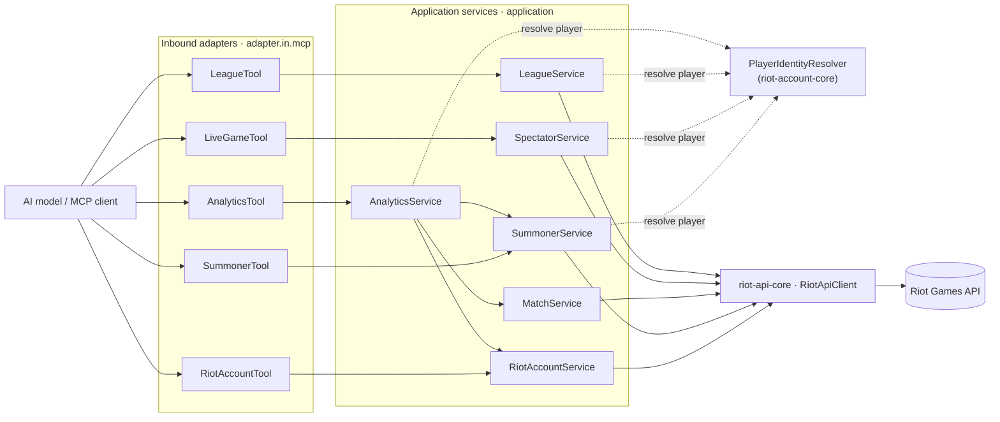

# `lol-mcp-server` — Architecture

This server is a set of League of Legends **bounded contexts** under `com.muddl.riot.lol`, each a
ports-and-adapters hexagon. The shared hexagon shape, the dependency rule, the HTTP client, routing,
and the enforcement mechanisms are described once at the [repository root](../ARCHITECTURE.md) — this
document covers only what is specific to the LoL server.

## Bounded contexts

```
com.muddl.riot.lol
├── account/          Thin @McpTool only — the real context lives in riot-account-core (platform N/A)
├── summoner/         Summoner profiles (platform-routed)
├── match/            Match IDs and detail, Match-V5 (region-routed) — now has MatchTool
├── spectator/        Live-game (current-game) data, Spectator-V5, PUUID-keyed (platform-routed)
├── analytics/        Composing context — aggregates account + summoner + match; has no Riot adapter
├── league/           Ranked entries + apex leagues, League-V4 (platform-routed) — the exemplar context
├── championmastery/  Champion mastery by player, Champion-Mastery-V4 (platform-routed)
├── champion/         Free-to-play rotation, Champion-V3 (platform-routed) — non-player-keyed
├── challenges/       Player challenge standing, LoL-Challenges-V1 (platform-routed)
├── status/           Platform status/incidents, LoL-Status-V4 (platform-routed) — non-player-keyed
└── clash/            Player Clash registrations, Clash-V1 (platform-routed)
```

One context is a deliberate exception to the standard hexagon shape:

- **`analytics`** has `domain/`, an `application/` service (depending on the account/summoner/match
  application services), and an `adapter/in/mcp/` tool — but **no** `adapter/out/riot` and no port,
  because it makes no direct Riot calls.

`league` is the **reference implementation** the remaining 1b contexts copy: a full mini-hexagon,
born on the final tool-naming convention, and the first LoL context to depend on
`PlayerIdentityResolver`.

## Tools and the `player` parameter

Every player-keyed tool takes a single `player` param (`GameName#TAG` or a raw PUUID) and is named
`lol_<context>_<action>`. Resolution happens in the **application service** via
`PlayerIdentityResolver` (from `riot-account-core`) — tools stay thin pass-throughs. The one
exception is the `account` tool, which disambiguates `#` locally because it needs account **data**
both ways and must not round-trip through the resolver. See
[ADR-0009](../docs/knowledge/decisions/ADR-0009-mcp-tool-contract.md).



(Outbound ports and `Riot<Context>Adapter` implementations are omitted from the diagram for
readability — each service depends on its own `<Context>Port`, implemented by a Riot adapter, exactly
as the [root dependency rule](../ARCHITECTURE.md#the-dependency-rule) describes.)

## Context independence, as applied here

`contexts_do_not_depend_on_each_other` (in `HexagonalArchitectureTest`) allows exactly two
composition edges — **`analytics → summoner`** and **`analytics → match`** — because `analytics`
composes those services. Every other cross-context reference fails the build. (`spectator → summoner`
was retired when spectator moved to Spectator-V5 and dropped its by-name tools.)

Account-domain usage is a separate, additional rule
(`only_analytics_and_the_account_tool_use_the_account_domain`): only `analytics` and this server's
thin `account` tool may reach the account **domain** (`..riot.account..`); identity resolution
(`..riot.account.identity..`) is open to every context. A negative-control test proves both halves
still bite. The mechanism behind both rules is described at the root
[Enforcement](../ARCHITECTURE.md#enforcement) section.

## Routing

Summoner, spectator, and league are **platform**-routed (`riotApiClient.platform(...)`); account and
match are **region**-routed (`riotApiClient.regional(...)`). The enum split makes the correct choice a
compile-time decision — see the root [routing section](../ARCHITECTURE.md#regional-vs-platform-routing).
