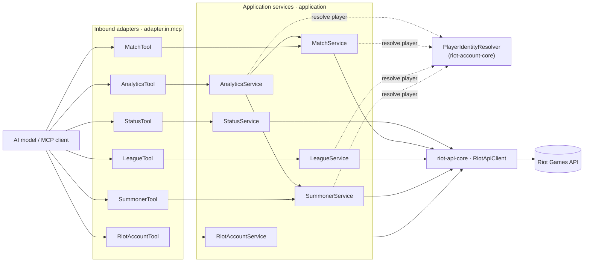

# `tft-mcp-server` — Architecture

This server is a set of Teamfight Tactics **bounded contexts** under `com.muddl.riot.tft`, each a
ports-and-adapters hexagon. The shared hexagon shape, the dependency rule, the HTTP client, routing,
and the enforcement mechanisms are described once at the [repository root](../ARCHITECTURE.md) — this
document covers only what is specific to the TFT server.

## Bounded contexts

```
com.muddl.riot.tft
├── account/     Thin @McpTool only — the real context lives in riot-account-core (platform N/A)
├── summoner/    TFT summoner profiles, TFT-Summoner-V1 (platform-routed)
├── league/      Ranked entries, apex leagues, paged tier entries, league-by-id, and the rated
│                (Hyper Roll) ladder, TFT-League-V1 (platform-routed)
├── match/       Match IDs and full detail, TFT-Match-V1 (region-routed)
├── status/      Platform status/incidents, TFT-Status-V1 (platform-routed) — non-player-keyed
└── analytics/   Composing context — aggregates summoner + match; has no Riot adapter
```

One context is a deliberate exception to the standard hexagon shape:

- **`analytics`** has `domain/`, an `application/` service (depending on the summoner and match
  application services), and an `adapter/in/mcp/` tool — but **no** `adapter/out/riot` and no port,
  because it makes no direct Riot calls.

`league` carries the widest tool surface of any context in either server: five tools over five
TFT-League-V1 endpoints, including two the LoL server does not expose at all — paged tier entries and
the Hyper Roll rated ladder — because TFT parity is measured against the Riot TFT-v1 API, not against
`lol-mcp-server`'s tool list (see the
[design spec](../docs/superpowers/specs/2026-07-19-tft-server-design.md)).

## Tools and the `player` parameter

Every player-keyed tool takes a single `player` param (`GameName#TAG` or a raw PUUID) and is named
`tft_<context>_<action>`. Resolution happens in the **application service** via
`PlayerIdentityResolver` (from `riot-account-core`) — tools stay thin pass-throughs. The one exception
is the `account` tool, which disambiguates `#` locally because it needs account **data** both ways and
must not round-trip through the resolver. See
[ADR-0009](../docs/knowledge/decisions/ADR-0009-mcp-tool-contract.md). The non-player-keyed tools —
`tft_status_platform`, `tft_league_apex_by_tier`, `tft_league_entries_by_tier`, `tft_league_by_id`,
and `tft_league_rated_ladder_by_queue` — take domain-appropriate params instead (a platform, tier,
division, league ID, or queue) and their services never depend on the resolver; see
[ADR-0014](../docs/knowledge/decisions/ADR-0014-non-player-keyed-tools.md).



(Outbound ports and `Riot<Context>Adapter` implementations are omitted from the diagram for
readability — each service depends on its own `<Context>Port`, implemented by a Riot adapter, exactly
as the [root dependency rule](../ARCHITECTURE.md#the-dependency-rule) describes.)

## Context independence, as applied here

`contexts_do_not_depend_on_each_other` (in `HexagonalArchitectureTest`) allows exactly two composition
edges — **`analytics → summoner`** and **`analytics → match`** — because `analytics` composes those
services. Every other cross-context reference fails the build.

Account-domain usage is a separate, additional rule
(`only_analytics_and_the_account_tool_use_the_account_domain`): only `analytics` and this server's
thin `account` tool may reach the account **domain** (`..riot.account..`); identity resolution
(`..riot.account.identity..`) is open to every context. A negative-control test proves both halves
still bite. The mechanism behind both rules is described at the root
[Enforcement](../ARCHITECTURE.md#enforcement) section.

## Routing

Summoner, league, and status are **platform**-routed (`riotApiClient.platform(...)`); account and
match are **region**-routed (`riotApiClient.regional(...)`) — the same split LoL uses, since TFT
reuses LoL's platform/region host schemes (no new routing abstraction; see the
[design spec](../docs/superpowers/specs/2026-07-19-tft-server-design.md)). The enum split makes the
correct choice a compile-time decision — see the root
[routing section](../ARCHITECTURE.md#regional-vs-platform-routing).
